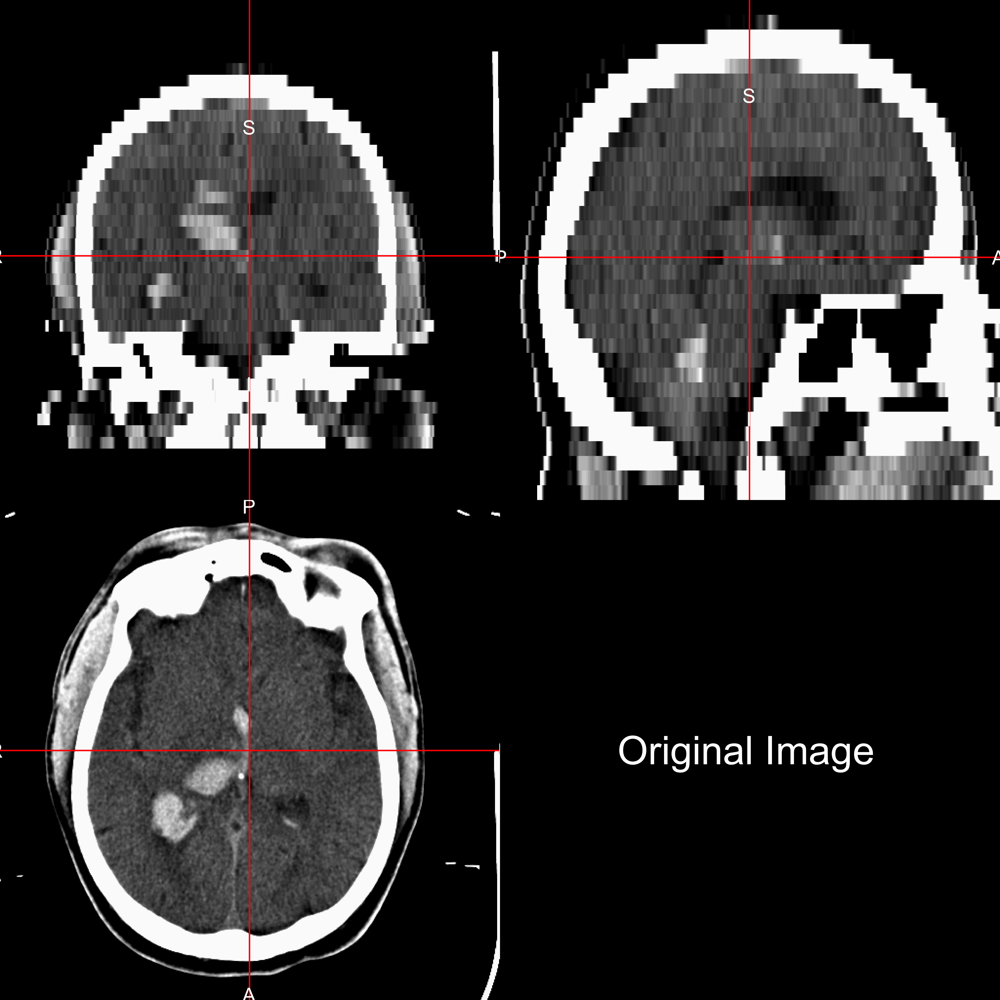
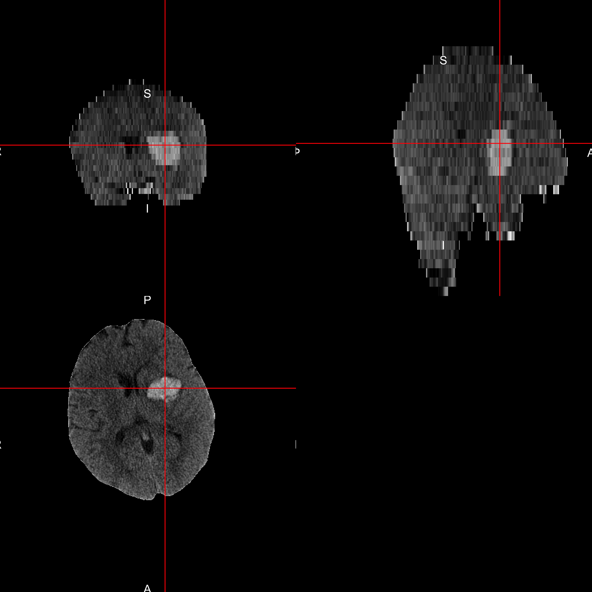
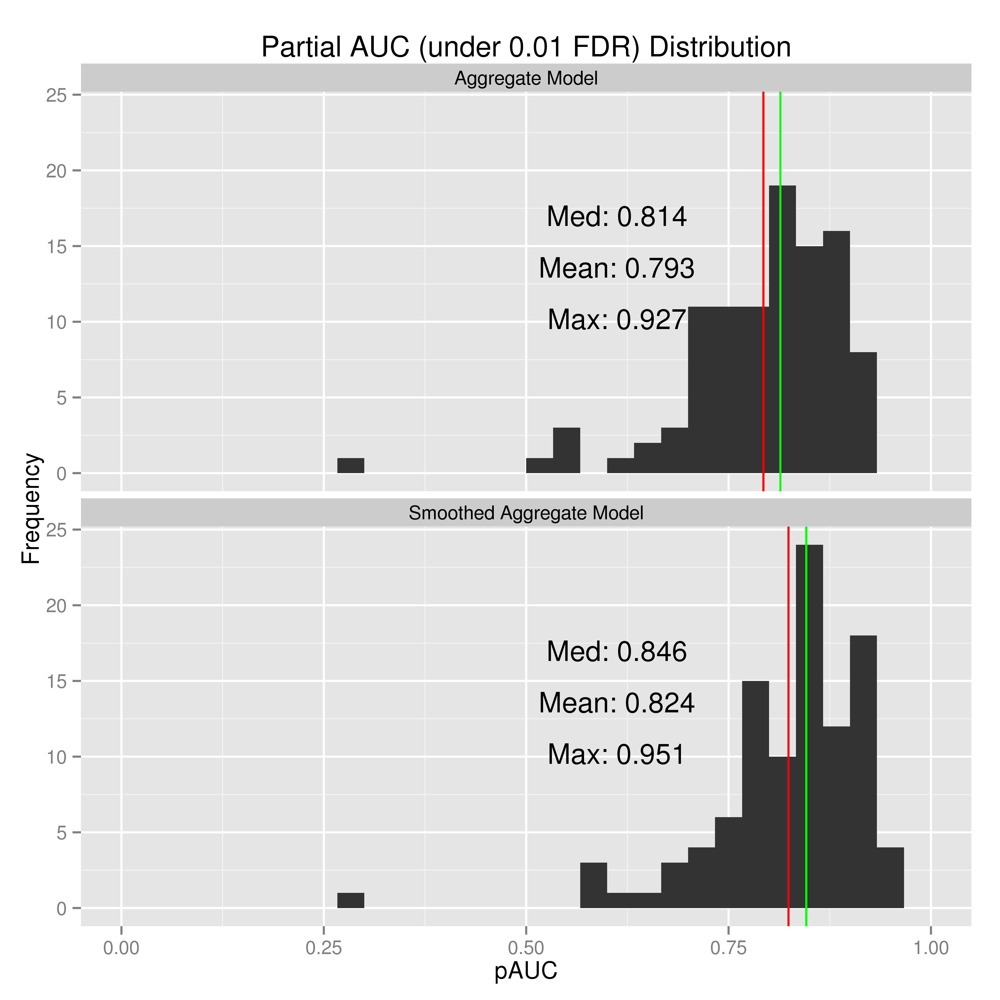
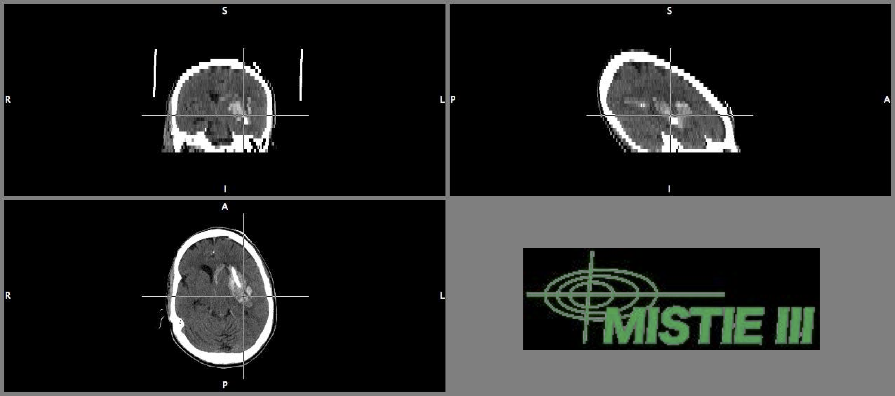

## CT is NOT MRI (specifically not T1/T2)
 
 

<!-- html table generated in R 3.1.1 by xtable 1.7-4 package -->
<!-- Wed Dec 10 11:49:02 2014 -->
<table border=1>
<tr> <th>  </th> <th> CT </th> <th> MRI </th>  </tr>
  <tr> <td align="right"> Domain </td> <td> Diagnostic </td> <td> Diagnostic/Research </td> </tr>
  <tr> <td align="right"> Units </td> <td> Houndsfield Units </td> <td> Arbitrary </td> </tr>
  <tr> <td align="right"> Templates </td> <td> One Publicly Available </td> <td> MNI Standard (Many Exist) </td> </tr>
  <tr> <td align="right"> Measures </td> <td> Measures humans/rooms/beds </td> <td> Measures Humans </td> </tr>
  <tr> <td align="right"> Methods </td> <td> ? </td> <td> Many </td> </tr>
   </table>

--- 

## Neuroimaging Data - voxels = 3D pixels

---

## Problem: Human + Room + FOV

All "objects" captured

--- &twocol w1:50% w2:50%

## CT Skull Stripping: Goal 

*** {name: left}

Want to go from this

*** {name: right}
To This:

--- &twocol w1:50% w2:50%

## CT Skull Stripping: Step 1 - Threshold

*** {name: left}

Threshold 0- 100 HU:

*** {name: right}
Result:

--- &twocol w1:50% w2:50%

## CT Skull Stripping: Step 2 - Smooth

*** {name: left}

Smooth with 1mm Gaussian

*** {name: right}
Result:

--- &twocol w1:50% w2:50%

## CT Skull Stripping: Step 3 - Run BET

*** {name: left}

Run BET from FSL:

*** {name: right}
Result (Skull Stripped Image):

--- &twocol w1:50% w2:50% bg:#d3d3d3

## 22 Scans: BET vs. Manual Segmentation (aka Natalie)

---

## We ran on 1062 scans (N = 133): MISTIE/ICES

--- 

## Give me some "statistics"

* Intraclass correlation estimate: 0.93, (95%CI : 0.91, 0.95).
* 115 scans for craniotomy or skull stripping failure (9.8%)

--- 

## ICH Prediction - data

* ICH are manually traced (**gold standard**)

---

## ICH Prediction - data

* ICH are manually traced (**gold standard**)
  * Time-consuming (Andrew looks tired)
  * Within and across-rater variability (think "interns" tracing)
* Can't do for large databases
  * Important for some processes, such as image registration
  * VISTA-ICH Images

--- 

## Proposed Solution

Primary Intracerebral Hemorrhage Prediction Employing Regression and Features Extracted from CT:

<strong>PItcHPERFECT</strong>

---

## PItcHPERFECT

* Create predictor variables:
  * Raw intensity
  * Z-scores in all 3 planes with only brain image (skull stripped)
  * Z-score compared to a template image

What is a z-score:
  If $\mu$ is a mean, and $\sigma$ is a standard deviation, then a z-score is:

$$
z = \frac{x - \mu}{\sigma}
$$

---

## PItcHPERFECT

* Create predictor variables:
  * Raw intensity
  * Z-scores in all 3 planes with only brain image (skull stripped)
  * Z-score compared to a template image
  * Indicator if intensity **$\geq 40$** (established threshold) & $\leq 80$ HU
  * Local moments (mean, sd, skew, kurtosis)
  * Large smoothers

---

## PItcHPERFECT

* Run a **logistic regression** with these predictors
* Model built on 10 subjects
* All on **SKULL STRIPPED DATA**

---

## Example Output: Start with Skull Stripped Image
 

---

## Example Output: Manual Segmentation
 

---

## Example Output: Automatic Segmentation
 

---

## Prediction Comparison
 

---

## Prediction Result: 51 "Validation" Patients
 
 

---

## Prediction Result: 51 "Validation" Patients
 
 

---

## Prediction Result: 51 "Validation" Patients
 
 

---

## Conclusions and Extensions
 
* Skull stripping can be done
  * Important in many analyses (e.g. image registration)
  * May use intracranial volume to standardize ICH volume

---

## Conclusions and Extensions
 
* ICH Segmentation has high specificity
  * Good for Localization
  * OK for volume estimates
  * Good enough for adaptive randomization

---

## Conclusions and Extensions
 
* Many new problems open and available
  * Can use these methods for **large datasets**
* Use for other diseases with CT imaging

---

## Conclusions and Extensions

* Virtual International Stroke Trials Archive (VISTA)

> "The purpose is to create an international consortium of investigators and a repository of source MRI and CT images toward the objectives of standardization and validation of acquisition, analytic, and clinical research methods of image-based stroke research."

--- &twocol w1:50% w2:50%

## Thanks

*** {name: left}

* Main Collaborators

<table>
<tr>
<td></td>
<td></td>
</tr>
</table>

<table>
<tr>

</tr> 
</table>

*** {name: right}

* Groups

<table>
<tr> <td></td> <td> </td>
</tr>
</table>

* Funding

<table>
<tr> <td>T32AG000247</td><td> NIA </td></tr>
<tr> <td>RO1EB012547</td><td> NIBIB</td> </tr>
<tr> <td>R01NS046309, RO1NS060910, RO1NS085211, R01NS046309, U01NS080824 and U01NS062851</td> <td>NINDS</td> </tr>
<tr><td>RO1MH095836</td> <td> NIMH </td></tr>
</table>

---

## MISTIE Trial - Intracerebral Hemorrhage

* Number of patients: **N = 123**, number randomized: **N = 96**

* Inclusion criteria: age **18-80** years old 

* **Over 65 years old**: 36 (37.5%), Surgical: 18 (33.3%), Medical: 18 (42.9%)

--- &twocol w1:50% w2:50%

## An "Ideal" MISTIE Patient: ICH Formed

---

## An "Ideal"" MISTIE Patient: Catheter Placed

---

## An "Ideal" MISTIE Patient: Clearance!

