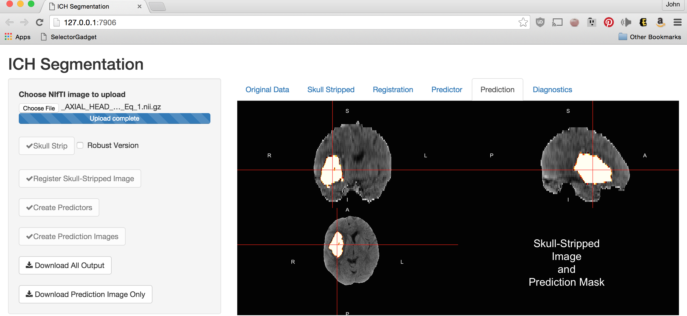

# Segmentation of Stroke Hemorrhages in X-ray Computed Tomography Scanning
John Muschelli - Johns Hopkins Bloomberg School of Public Health  http://johnmuschelli.com/jnj_talk.html  
February 24, 2016  

## The MISTIE Stroke Trial 

* Minimally Invasive Surgery plus r-tPA for Intracerebral Hemorrhage Evacuation (<strong>MISTIE</strong>) 
    - Multi-center, multi-national Phase II clinical trial
* Patients with intracerebral hemorrhages (≥ 20 millilters)

* http://braininjuryoutcomes.com/mistie-about

## What is Intracranial/Intracerebral hemorrhage?

- When a blood vessel ruptures into:
    + **Tissue ⇒ intracerebral hemorrhage (ICH)**
- ≈ 13% of strokes
- Larger ICH Volume ⇒ Worse Outcome

<a href = "http://www.heartandstroke.com/site/c.ikIQLcMWJtE/b.3484153/k.7675/Stroke__Hemorrhagic_stroke.htm" style ="word-wrap: break-word;" >http://www.heartandstroke.com/site/c.ikIQLcMWJtE/b.3484153/k.7675/Stroke__Hemorrhagic_stroke.htm</a>

## X-ray Computed Tomography (CT) Scans

Images are acquired from an X-ray scanner.  
x-ray goes around object and detector the other side of the object determines how many x-rays are recovered 
- fancy transform
- Image!

Image from http://www.cyberphysics.co.uk/topics/medical/CTScanner.htm

 

## ICH Segmentation, Volume/Location Estimation 

Want to go from a brain image:

 
To a binary hemorrhage mask:

## Subject Data used: 111 scans (1 per patient)

----------------------------------------
&nbsp;                           Overall
---------------------------- -----------
Age in Years: Mean (SD)      60.8 (11.2)

Male: N (%)                   76 (68.5%)

Clot Location RC (%)                    

&nbsp;&nbsp;&nbsp;Putamen      68 (61.3)

&nbsp;&nbsp;&nbsp;Lobar        33 (29.7)

&nbsp;&nbsp;&nbsp;Globus        6 ( 5.4)
Pallidus                                

&nbsp;&nbsp;&nbsp;Thalamus      4 ( 3.6)

Diagnostic ICH Volume in mL: 37.4 (20.1)
Mean (SD)                               
----------------------------------------

- Adults (inclusion criteria 18-80 years old)
- Mostly males
- Reader-classified Location of Hemorrhage

## Image Representation: voxels (3D pixels)

 

Muschelli, John, Elizabeth Sweeney, and Ciprian Crainiceanu. "brainR: Interactive 3 and 4D Images of High Resolution Neuroimage Data." R JOURNAL 6.1 (2014): 42-48.

## Step 1: Create Predictors of ICH   

## Data Structure for One Patient     

---

 
  
 
  Training Data Structure
  
  * Stack together 10 randomly selected patients
  * Train model/classifier on this design matrix

  
  
    
  

    
  
 

## Step 2: Fit Models 

Let $Y_{i}(v)$ be the presence / absence of ICH for voxel $v$ from person $i$.  

$$
\text{logit}\left(P(Y_{i}(v) = 1)\right) = \beta_0 + \sum_{k= 1}^{p} x_{i, k}(v)\beta_{k}
$$
where $x_{i, 1}(v) \dots x_{i, 21}(v)$ are the predictors.  

## Predicted Volume Estimates True Volume 

## Patient with Median Overlap in Validation Set

 

## Shiny Application: http://bit.ly/ICH_SEG 

# Thank You

## Local Moment Information: Mean

For each voxel,  neighborhood $N(v)$, of all adjacent neighboring voxels in $3$ dimensions.  Let $x_k(v)$ denote the voxel intensity in HU for voxel neighbor $k$, where $k = 1, \dots, 27$. 
$$
\begin{equation}
\bar{x}(v) = \frac{1}{N(v)} \sum_{k \in N(v)} x_k(v) \label{eq:mean}
\end{equation}
$$

## Local Moment Information: Higher Moments

## Population Voxel-wise Mean/SD Image
From $32$ CT images from Dr. Rorden (personal communication), we created a voxel-wise mean image $M$ and voxel-wise standard deviation $S$ image, after registering to a CT template (Rorden, et al., 2012).  

## Standardized-to-template Intensity
We created a standardized voxel intensity with respect to the template ($z_{i,\text{template}}$) using the following equation:

 
 

$$
z_{i,\text{template}}(v) = \frac{x_{i}(v) - M(v)}{S(v)}
$$

