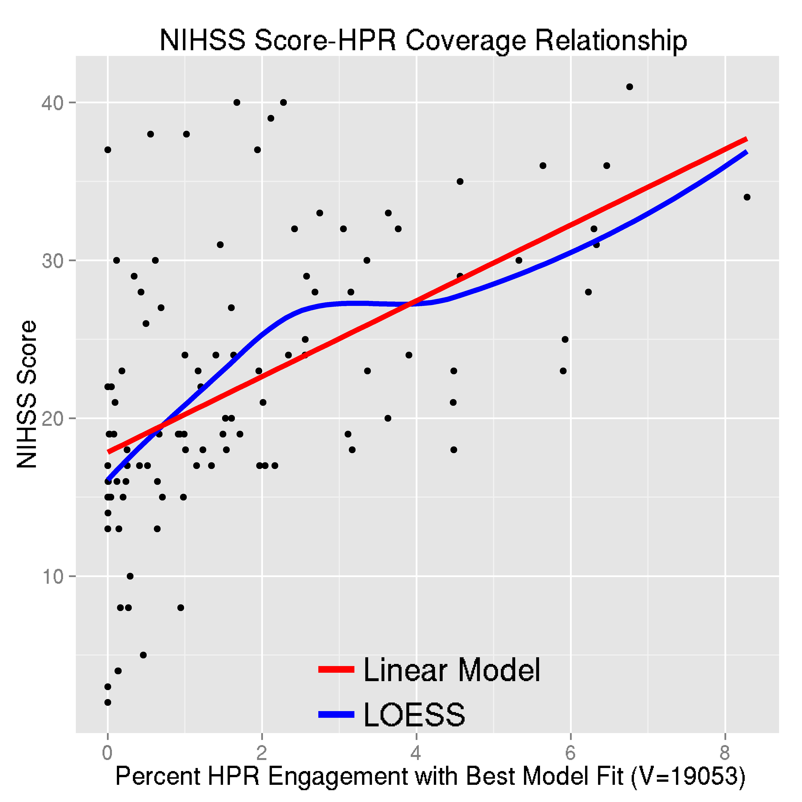

<script type="text/x-mathjax-config">
MathJax.Hub.Config({ TeX: { extensions: ["color.js"] }});
</script>

```{r opts, prompt=FALSE, echo=FALSE, message=FALSE, warning=FALSE, error=FALSE, comment=""}
library(knitr)
library(knitcitations)
opts_chunk$set(echo = FALSE, prompt = FALSE, message = FALSE, warning = FALSE, comment = "", results = 'hide')
setwd("~/CT_Registration/RIP_SlideDeck/RIP_2015_Dec/")
```


```{r, prompt=TRUE, echo=FALSE, message=FALSE, warning=FALSE}
rm.obj = ls()
rm.obj = rm.obj[ !(rm.obj %in% c("fname", "slide"))]
rm(list = rm.obj)
library(ggplot2)
library(xtable)
library(scales)
library(fslr)
library(pander)
options(stringsAsFactors = FALSE)
rootdir = path.expand("~/Dropbox/CTR/DHanley/MISTIE")
homedir = file.path(rootdir, "ICH Analysis")
Mdir = file.path(rootdir, "MISTIE DSMB Analysis")
resdir <- file.path(homedir, "results")
rundir <- file.path(resdir, "Manuscript")
progdir <- file.path(homedir, "stataprograms")
datadir <- file.path(Mdir, "statacalc")
knitdir <- "~/CT_Registration/RIP_SlideDeck/RIP_2015_Dec/"
load(file=file.path(rundir, "All_IncludingICES_Patients.Rda"))
load(file=file.path(rundir, "Randomized_Patients.Rda"))
load(file=file.path(knitdir, "111_Filenames.Rda"))
```

```{r demog}
library(tableone)
library(stargazer)
library(pander)
alldemog = read.csv("All_180_FollowUp_wDemographics.csv", as.is = TRUE)
alldemog = alldemog[, c("patientName", "Clot_Location_RC")]
n.ids = length(unique(fdf$id))
demog = as.numeric(gsub("-", "", fdf$id))
demog = all.alldat[ all.alldat$patientName %in% demog, ]
demog$Clot_Location_RC = NULL
demog = merge(demog, alldemog, all.x = TRUE )
stopifnot(nrow(demog) == n.ids)
demog$Diagnostic_ICH_Volume =demog$ICH_Dx_10 * 10 
demog$Diagnostic_IVH_Volume =demog$IVH_Dx_10 * 10 
tt = sort(table(demog$Clot_Location_RC), decreasing = TRUE)
nclot = names(tt)[tt > 0]
demog$Clot_Location_RC = factor(demog$Clot_Location_RC, levels = nclot)

vars = c("Age", "Gender", "Clot_Location_RC",
         "Diagnostic_ICH_Volume")
catvars = c("Gender", "Clot_Location_RC")
tb1 = CreateTableOne(vars = vars, factorVars = catvars, 
                     data = demog)
tb1 = print(tb1, contDigits = 1)
gen = grepl("Gender", rownames(tb1))
rownames(tb1)[ gen ] = "Male: N (%)"
tb1[gen,1] = gsub("\\((.*)\\)", "(\\1%)", tb1[gen,1,drop=FALSE])

rownames(tb1) = gsub("_", " ", rownames(tb1))
rownames(tb1) = gsub(" \\(mean", ": Mean", rownames(tb1))
rownames(tb1) = gsub("(sd))", "(SD)", rownames(tb1), fixed=TRUE)
rownames(tb1) = gsub("Volume", "Volume in mL", rownames(tb1), fixed=TRUE)
rownames(tb1) = gsub("Age", "Age in Years", rownames(tb1), fixed=TRUE)
rownames(tb1) = gsub("Clot_Location_RC", "ICH Location", rownames(tb1), fixed=TRUE)
tb1 = tb1[rownames(tb1) != "n", , drop=FALSE]
# tb1 = pander.return(tb1)
# tb1 = tb1[ tb1 != ""]
```

```{r}
library(RefManageR)
library(knitcitations)
bib <- ReadBib(file.path(knitdir, 'Oral_Proposal.bib'))
x = sapply(bib, citep)
```


## Overview of Work/Research

- Neuroimaging and R
- Segmentation of Computed Tomography (CT) scans
    - Brain segmentation
    - Hemorrhage segmentation
- Quantitative hemorrhage localization

## Overview of Work/Research

- Neuroimaging and R
- Segmentation of Computed Tomography (CT) scans
    - Brain segmentation
    - Hemorrhage segmentation
- **Quantitative hemorrhage localization**

# Neuroimaging and R: <br/> <br/> Creating Tools I Would Use 

## Authored R Packages:

<div id="wrap">
<div id="left_col">

- fslr <p style='font-size: 12pt;'>(Muschelli, John, et al. "fslr: Connecting the FSL Software with R." R JOURNAL 7.1 (2015): 163-175.)</p>
- brainR <p style='font-size: 12pt;'>(Muschelli, John, Elizabeth Sweeney, and Ciprian Crainiceanu. "brainR: Interactive 3 and 4D Images of High Resolution Neuroimage Data." R JOURNAL 6.1 (2014): 42-48.)</p>
- extrantsr
- cttools
- dcm2niir
- matlabr
- spm12r


</div>
<div id="right_col">

- drammsr
- itksnapr
- papayar
- WhiteStripe
- oasis
- SuBLIME
- googleCite
- diffr

</div>
</div>


## fslr: Connecting FSL and R

fslr

- Ports most of FSL functionality into R 
- https://cran.r-project.org/web/packages/fslr/index.html

FSL 

- Full neuroimaging suite of analysis and preprocessing tools
- Actively developed (first release in 2000) `r citep("jenkinson_fsl_2012")`
- Popular: 13.9% of published neuroimaging studies used FSL `r citep("carp_secret_2012")`.
- Open source and free (for academics)


## Number of Downloads (CRAN packages)

From the `cranlogs` R package:


```{r, cache= TRUE}
if (!require(cranlogs)) {
  library(devtools)
  install_github("metacran/cranlogs")
}
library(plyr)
first_date = "2014-01-10"
today = Sys.Date()
long_today = format(Sys.time(), "%B %d, %Y")
packs = c("fslr", "brainR", "matlabr", "spm12r", "WhiteStripe", "diffr", "oasis")
last_week = cran_downloads( when = "last-week",
                            packages = packs)
last_week = ddply(last_week, .(package), summarise, 
                  Last_Week = sum(count))
dl = cran_downloads( from = first_date, to = today,
                     packages = packs)
dl = ddply(dl, .(package), summarise, All_Time = sum(count))
dl = merge(dl, last_week)
dl = arrange(dl, desc(All_Time))
colnames(dl) = c("Package", "All Time", "Last Week")
```


```{r}
library(DT)
```

```{r, results = "asis", eval = TRUE}
datatable(dl, filter = "none", selection = "none", rownames = FALSE,
          options = list(dom = 't', autoWidth = TRUE,
                         columnDefs = list(list(
                           className = 'dt-center',
                           targets = 0)))
)
```

```{r outtab, results='asis', eval = FALSE}
pander(dl)
```

# Neuroimaging Analysis in Stroke

## The MISTIE Stroke Trial 

* Minimally Invasive Surgery plus r-tPA for Intracerebral Hemorrhage Evacuation (<strong>MISTIE</strong>) 
    - Multi-center, multi-national Phase II clinical trial
* 111 baseline CT scans from 112 subjects from 26 centers
* Lobar and deep hemorrhages with volume ≥ 20cc
* Stroke-related impairment measured by NIH Stroke Scale (NIHSS,higher is worse) 


* http://braininjuryoutcomes.com/mistie-about


## What is Intracranial/Intracerebral hemorrhage?

<div class="columns-2" style='font-size: 28pt;'>
- When a blood vessel ruptures into:
    + **Tissue ⇒ intracerebral hemorrhage (ICH)**
    + Ventricles ⇒ intraventricular hemorrhage (IVH)
- ≈ 13% of strokes


<p style = "font-size:10.5px; ">
<a href = "http://www.heartandstroke.com/site/c.ikIQLcMWJtE/b.3484153/k.7675/Stroke__Hemorrhagic_stroke.htm" style ="word-wrap: break-word;" >http://www.heartandstroke.com/site/c.ikIQLcMWJtE/b.3484153/k.7675/Stroke__Hemorrhagic_stroke.htm</a>
</p>

</div>


## X-ray Computed Tomography (CT) Scans
<div class="notes">
Images are acquired from an X-ray scanner.  
x-ray goes around object and detector the other side of the object determines how many x-rays are recovered 
- fancy transform
- Image!
</div>
<div style="width:48%;float:left;">
<sub><sup><sub><sup>Image from http://www.cyberphysics.co.uk/topics/medical/CTScanner.htm</sup></sub></sup></sub>

<br>
</div>
<div style="margin-left:48%;">

</div>

## Problem: CT Scans Capture **Everything**


## Brain Segmentation of (CT) scans


<div class="columns-2">
Want to go from this:

<br/>

</div>

## Brain Segmentation of (CT) scans


<div class="columns-2">
Want to go from this:

<br/>
To this:

</div>

## Publicly Available code

* Muschelli, John, et al. "Validated automatic brain extraction of head CT images." NeuroImage 114 (2015): 379-385. 
* R code: http://bit.ly/CTBET_RCODE
    * Based on **fslr** 
* bash code: http://bit.ly/CTBET_BASH


# ICH Segmentation and ICH Volume Estimation: <br/> <br/> Larger ICH Volume ⇒ Worse Outcome

```{r biblio, results='hide'}
bibliography() 
```

## ICH Segmentation, Volume/Location Estimation 

<div class="columns-2">
Want to go from this

<br/>
To this:

</div>


## Image Representation: voxels (3D pixels)
<div class="columns-2">

<br>


<p style='font-size: 10pt;'>Muschelli, John, Elizabeth Sweeney, and Ciprian Crainiceanu. "brainR: Interactive 3 and 4D Images of High Resolution Neuroimage Data." R JOURNAL 6.1 (2014): 42-48.</p>
</div>


## Step 1: Create Covariates   

## Step 2: Fit Models 

Let $y_{i}(v)$ be the presence / absence of ICH for voxel $v$ from person $i$.  

General model form: 
$$
\text{logit}\left(P(y_{i}(v) = 1)\right) = f(X_i)
$$

where $X_i = (x_{i, 1} \dots x_{i, 21})$ are the covariates.

## Models Fit on the Training Data

- Logistic Regression: \(f(X) = \beta_0 + \sum_{k= 1}^{p} x_{i, k}(v)\beta_{k}\)
- Generalized Additive Models `r citep("hastie_generalized_1990")`
- LASSO `r citep(c("tibshirani_regression_1996", "friedman_regularization_2010"))`: 
$$ L(f(X)) \propto \beta_0 + \sum_{k= 1}^{p} x_{i, k}(v) \beta_{k} + \lambda \sum_{k= 1}^{p} \left|\beta_{k}\right|
$$
- Random Forests `r citep(c("randomForest", "breiman2001random"))`
<div class="centerer">
\(f(X) \propto\) 
</div>


## Patient with Median Dice Overlap in 102 Patients

  

## Compare Estimated to True Volume <br/> <br/> 

## Compare Estimated to True Volume 


## Shiny App: http://bit.ly/ICH_SEG 


# Quantitative hemorrhage localization

## Localization Goals

2. Create a 3-dimensional (3D) density map of hemorrhages in MISTIE population
3. Quantify of hemorrhage engagement of regions in the brain
4. Determine if differences in location relate to NIHSS
5. Generate a stroke region of engagement (ROI) using within-sample validation.


## Localization Processing Steps 
  
1. Image spatially registered to a CT template `r citep("rorden_age-specific_2012")` using SPM (Wellcome Trust)
2. Hemorrhage mask/regions of interest (ROI) mapped to the template
3. Visual inspection of registered images: no exclusions
4. ICH distribution (proportion of subjects who have ICH at that voxel location in template space)
    - Take the average of masks in template space
  


## Registered Images and Masks/Regions of Interest (ROI)

<div class="container">
   <div class="column-left">
   Raw Image:
   
   </div>
   <div class="column-center">
   Registered Image:   
   
   </div>
   <div class="column-right">
   Registered ROI:
   
   </div>
</div>


## Average ROIs ⇒ Population ICH Distribution


  
## Voxel-wise Regression/T-tests
Let ${\rm NIHSS}_i$ be the NIHSS for patient $i$, voxel $v$. At each voxel, across subjects, we fit the following model: <br/><p style ="text-align: center;">${\rm NIHSS}_i = \beta_0+\beta_{1,v} I({\rm ICH = 1}) + \epsilon_{iv}$:</p>


- Focus on template space voxels where at least $10$ subjects had stroke ($V = 166,202$)


## Voxel-wise P-value Map


## High Predictive Regions
Due to a large number of tests, a Bonferroni correction (or FDR) did not result in singificant p-values.  

Create a High Predictive Region (HPR) based 6 different thresholds: 

   - Raw p-value threshold ($0.05$, $0.01$, $0.001$) 
   - Select top-ranked voxels based on p-value (top $1000$, $2000$, $3000$ voxels)
   - Calculated the overlap of the HPR for each scan $i$
$$
\text{HPR Coverage}_i = \frac{\text{# Voxels classified ICH in HPR for scan } i}{\text{# Voxels in HPR}} \times 100\% \nonumber
$$

## Mask from P-value Threshold of $0.01$

<div style="width:48%;float:left;">

</div>
<div style="margin-left:48%;">

</div>


## Selecting an HPR 

Using the adjusted $R^2$, we fit the models for each HPR to select the "best" from the different thresholds:

$$\begin{eqnarray} 
{\rm NIHSS}_i &=& \beta_0 + \beta_1 {\rm Coverage}_i \\
&+& \gamma_1{\rm Age}_i  +\gamma_2{\rm Sex}_i +\gamma_3{\rm ICHVol}_i + \epsilon_{i}\\
\end{eqnarray}$$


## Regress ROIs against stroke severity scores 

<div style="width:48%;float:left;">

</div>
<div style="margin-left:48%;">

</div>

## Compare HPR to using Locations

Using the adjusted $R^2$, we compared the models:

$$\begin{eqnarray} 
{\rm Y}_i &=& \beta_0 + \beta_1 {\rm Coverage}_i \\
&+& \gamma_1{\rm Age}_i  +\gamma_2{\rm Sex}_i +\gamma_3{\rm ICHVol}_i + \epsilon_{i}\\
\end{eqnarray}$$
to that of the categorical indicator of location:
$$\begin{eqnarray} 
{\rm Y}_i &=& \beta_0 + \beta_1 I({\rm Lobar}_i) + \beta_2 I({\rm Globus{ }Pallidus }_i) + \beta_3 I({\rm Thalamus}_i) \\
&+& \gamma_1{\rm Age}_i  +\gamma_2{\rm Sex}_i +\gamma_3{\rm ICHVol}_i + \epsilon_{i}
\end{eqnarray}$$
where $I(k)$ represents the indicator that ICH location was $k$


## How do we test whether HPR coverage performs better?

- Recall: data-based algorithm for defining the HPR

Procedure (P):

- Fit voxel-wise models
- Collect the most predictive voxels
- Produce subject-level predictors by coalescing voxels

Problems:

- Multiplicity
- Double-dipping


## Using the outcome twice! Double Dipping

- Dip: look at the data, construct predictors
- Double-dip: are the new predictors predictive?
- This violates one of the basic principles of Statistics: the separation between the exploratory and confirmatory phases of the analysis

## One Possible Solution: Permutation Testing 

Permutation procedure:

1.  Permute outcomes
2.  Apply selection procedure P and obtain HPR
3.  Calculate adjusted $R^2$

Compare adjusted $R^2$ from the original data with its permutation distribution

Null hypothesis: the prediction performance of HPR coverage is the same with the prediction performance of HPR coverage when there is no association between location and outcome 

Result: Permutation test p-value $<0.01$


## Conclusions of Stroke Analyses
<div style="font-size: 24pt">
- We can segment ICH volume from CT scans <br/><br/>
- Voxel-wise regression can show regions associated with severity <br/><br/>
- 
</div>


## Future Work of Stroke Analyses

<div style="font-size: 24pt">

- We can segment ICH volume from CT scans
    - **Incorporate variability of estimated volume**
- Voxel-wise regression can show regions associated with severity
    - **Validate these regions (MISTIE III)**
- 

</div>

## Other Work

<div style="font-size: 24pt">

- Segmentation of Gadolinium-Enhancing Lesions in Patients with MS on MRI (T1w, T2w, FLAIR, PD), (with Dr. Taki Shinohara)
- Catheter scoring with pre/post-op registration for ICH 
- Creating Department-level indices of publication (with Dr. Jeff Leek)

</div>


# Thank You


## Subject Data used: 112 scans (1 per patient)
<div id="wrap">
<div id="left_col">

```{r, results='asis'}
x = pandoc.table.return(tb1, style="rmarkdown", split.table = Inf)
cat(x)
```

</div>
<div id="right_col"  style='font-size: 24pt;'>


- Adults (inclusion criteria 18-80 years old)
- Large ICH areas
- Small Intraventricular Hemorrhages (IVH)
</div>

</div>


## Global Head Information: Smoothed Images

Smoothing the original image using large Gaussian kernels ($\sigma = 5mm^3,10mm^3, 20mm^3$) can capture any potential homogeneity throughout the scan.  

<div class="container">
   <div class="column-center">
   $\sigma = 10$

</div>
   <div class="column-left">
   $\sigma = 5$

</div>
   <div class="column-right">
   $\sigma = 20$

   </div>
</div>


## Larger ICH ⇒ Worse Outcome
<div style="font-size: 14pt; color:black;">
<br>
J. P. Broderick, T. G. Brott, J. E. Duldner, et al. **"Volume of intracerebral hemorrhage. A powerful and easy-to-use predictor of 30-day mortality."** In: _Stroke_ 24.7 (1993), pp. 987-993.

S. Davis, J. Broderick, M. Hennerici, et al. **"Hematoma growth is a determinant of mortality and poor outcome after intracerebral hemorrhage"**. In: _Neurology_ 66.8 (2006), pp. 1175-1181.

L. C. Jordan, J. T. Kleinman and A. E. Hillis. **"Intracerebral hemorrhage volume predicts poor neurologic outcome in children"**. In:
_Stroke_ 40.5 (2009), pp. 1666-1671.

S. Tuhrim, D. R. Horowitz, M. Sacher, et al. **"Volume of ventricular blood is an important determinant of outcome in supratentorial intracerebral hemorrhage"**. In: _Critical care medicine_ 27.3 (1999),
pp. 617-621.
</div>

# NIHSS 
# One panel
