# Automated Intracerebral Hemorrhage Segmentation of CT Scans
John Muschelli  
January 13, 2015  

## What is Intracranial hemorrhage?

 - When a blood vessel ruptures into 
    + tissue: intracerebral hemorrhage (ICH)
    + ventricles: intraventricular hemorrhage (IVH)
 - ≈ 13% of strokes    

http://www.heartandstroke.com/site/c.ikIQLcMWJtE/b.3484153/k.7675/Stroke__Hemorrhagic_stroke.htm

# Larger ICH Volume ⇒ Worse Outcome

J. P. Broderick, T. G. Brott, J. E. Duldner, et al. **"Volume of intracerebral hemorrhage. A powerful and easy-to-use predictor of 30-day mortality."** In: _Stroke_ 24.7 (1993), pp. 987-993.

S. Davis, J. Broderick, M. Hennerici, et al. **"Hematoma growth is a determinant of mortality and poor outcome after intracerebral hemorrhage"**. In: _Neurology_ 66.8 (2006), pp. 1175-1181.

L. C. Jordan, J. T. Kleinman and A. E. Hillis. **"Intracerebral hemorrhage volume predicts poor neurologic outcome in children"**. In:
_Stroke_ 40.5 (2009), pp. 1666-1671.

S. Tuhrim, D. R. Horowitz, M. Sacher, et al. **"Volume of ventricular blood is an important determinant of outcome in supratentorial intracerebral hemorrhage"**. In: _Critical care medicine_ 27.3 (1999),
pp. 617-621.

## X-ray Computed Tomography (CT) Scans

Images are acquired from an X-ray scanner.  
x-ray goes around object and detector the other side of the object determines how many x-rays are recovered 
- fancy transform
- Image!

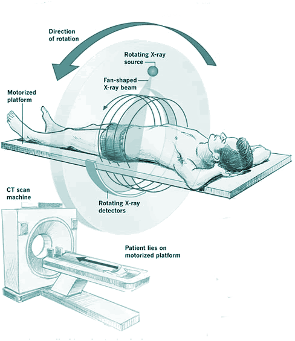
 
Image from http://www.cyberphysics.co.uk/topics/medical/CTScanner.htm

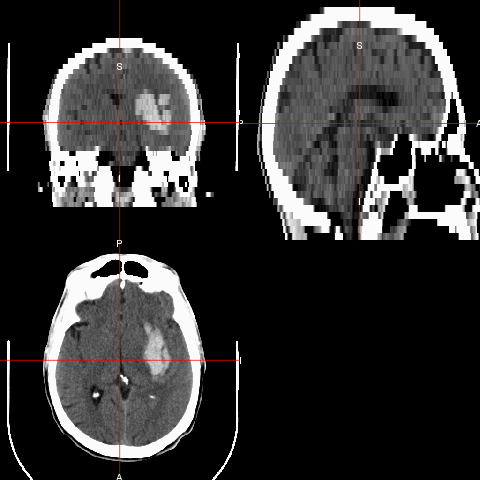

## CT scan Characteristics

- This is an example of a CT scan of a brain with no pathology
- Note the bone
An attenuation coefficient characterizes how easily the X-ray beam penetrated that area of the brain.

* Data are in Hounsfield Units (HU), which are "standardized"
$$
HU(v) = 1000 \times \frac{\mu(v) - \mu_{\text{water}}}{ \mu_{\text{water}}- \mu_{\text{air}}}
$$
where $\mu$ is the linear attenuation coefficient and $v$ denotes voxel.
* $\mu_{\text{water}}$ and $\mu_{\text{air}}$ are calibrations from each scanner.

## CT scan Characteristics 

- Here are the HU ranges for stuff

Standard HU Ranges:

* Bone – high intensity (1000 HU)
* Air – low intensity (-1000 HU)
* Water - 0 HU
* Blood 30-80 HU
* White/Gray Matter ≈ 0 - 100 HU

## Get ICH Mask from Manual Segmentation

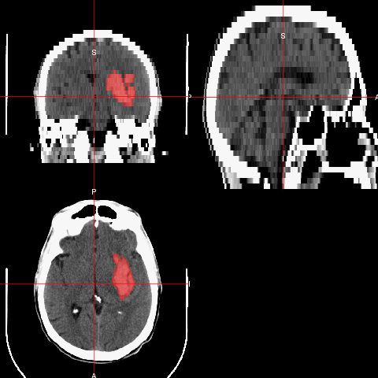

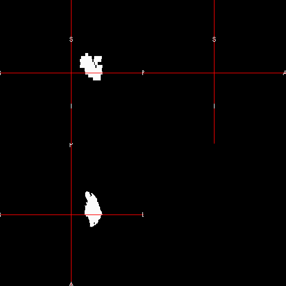

## Problems with Manual Segmentation

* Manual tracing is the **gold standard** but:
    + Time-consuming
    + Requires training
    + Has within- and across-rater variability
* Infeasible for large databases

## Solution: PItcHPERFECT {.flexbox .vcenter}

<b>P</b>rimary  **I**n**t**ra**c**erebral  **H**emorrhage  **P**rediction  **E**mploying  **R**egression and  **F**eatures  **E**xtracted from  **CT** 

## Covariates 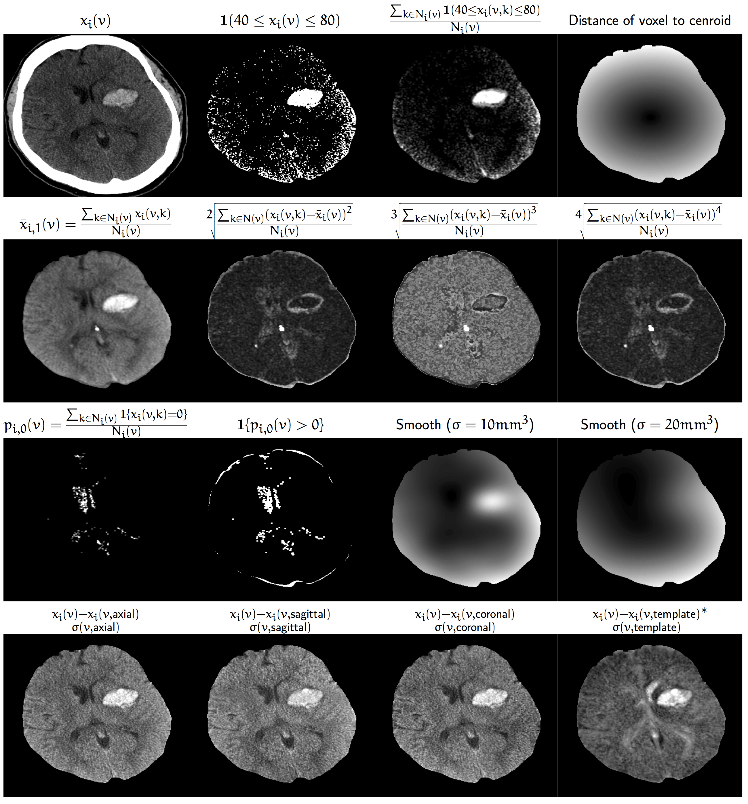

## PItcHPERFECT uses Logistic Regression
Let $y_{i,j}$ be the presence / absence of ICH for voxel $j$ from person $i$.
$$
\text{logit}\left(y_{i, j}\right) = \beta_0 + \sum_{k= 1}^{p} x_{i, j, k}\beta_{k}
$$

* Case-control sample voxels for a fixed percentage (25%) of outcome
  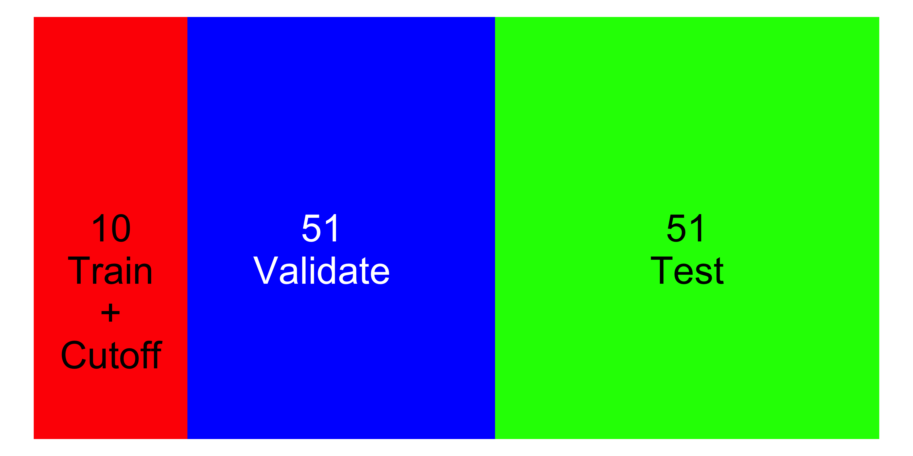
  

<!--
* Based on the scans from the first 10 patients (non-random)
  + Fit logistic model, predict on non-training data, derive probability cutoff
-->
<!--
where the $x$'s are: 

 1. Voxel intensity: $HU_{i,j}$
 2. Local moments (mean, sd, skew, kurtosis) of $HU_{i,j}$ 
 3-5. Stanardardized intensity: $\frac{HU_{i,j} - \mu_{i}}{\sigma_i}$
 6. Distance of voxel $j$ from brain center
 

 

 
 7-8. $I\left(HU_{i,j} \geq 40\, \&\, HU_{i,j} \leq 80\right)$ and local mean
 
 9-10. Gaussian-smoothed image $(\sigma \in \{10, 20\}\text{mm})$
  
  11.  Standardized intensity to a template: $\frac{HU_{i,j} - \mu_{i, temp}}{\sigma_{i, temp}}$

-->

## Data Used: 112 scans (1 per patient)

|                 &nbsp;                  |   Overall   |
|:---------------------------------------:|:-----------:|
|           **Age (Mean (SD))**           | 60.7 (11.2) |
|          **Gender = Male (%)**          |  77 (68.8)  |
|  **Diagnostic ICH Volume (Mean (SD))**  | 37.7 (20.2) |
|  **Diagnostic IVH Volume (Mean (SD))**  |  3.2 (6.3)  |

CT scans from MISTIE II trial. 

## Assessing Performance 
For each validation scan we can calculate the following 2-by-2 table, where the cells represent number of voxels and a corresponding Venn diagram:

<table class = 'rmdtable' style='font-size: 26px;'>
<tr class = "header"><td></td><td></td><td colspan="2">Manual</td></tr>
<tr class = "header"><td></td><td></td><td>0</td><td>1</td></tr>
<tr><td rowspan="2"> PitCH</td><td>0</td><td style='font-size: 40px;'>TN</td><td style="color:blue">FN</td></tr>
<tr><td>1</td><td style="color:red">FP</td><td style="color:purple">TP</td></tr>
</table>

## Dice Similarity

We calculate the Dice Similarity Index (DSI):
$$
\definecolor{red}{RGB}{255,0,0}
\definecolor{blue}{RGB}{0,0,255}
\definecolor{purple}{RGB}{128,0,128}
\definecolor{blac,}{RGB}{0,0,0}
\frac{ \color{purple} 2 \times \#  \text{TP} }{ \color{purple}  2 \times \#\text{TP} \color{black} + \color{red} \text{FN} \color{black} + \color{blue} \text{FP}} 
$$

- 0 indicates no overlap
- 1 means perfect agreement  

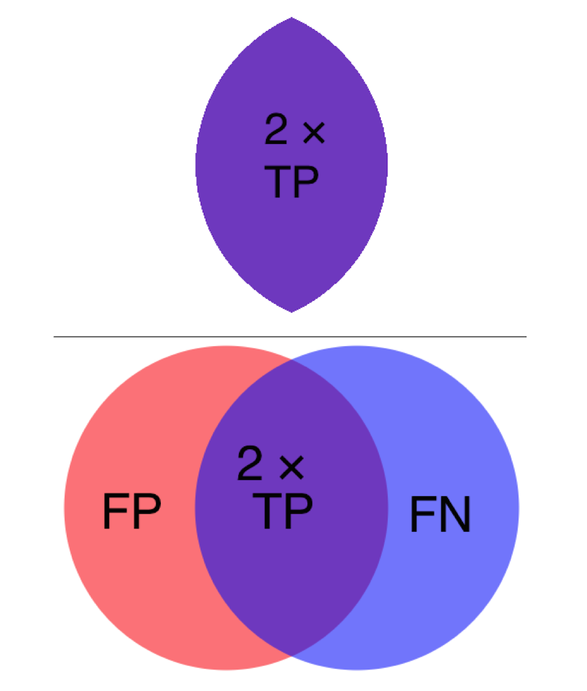

## Test case: Manual Segmentation
 
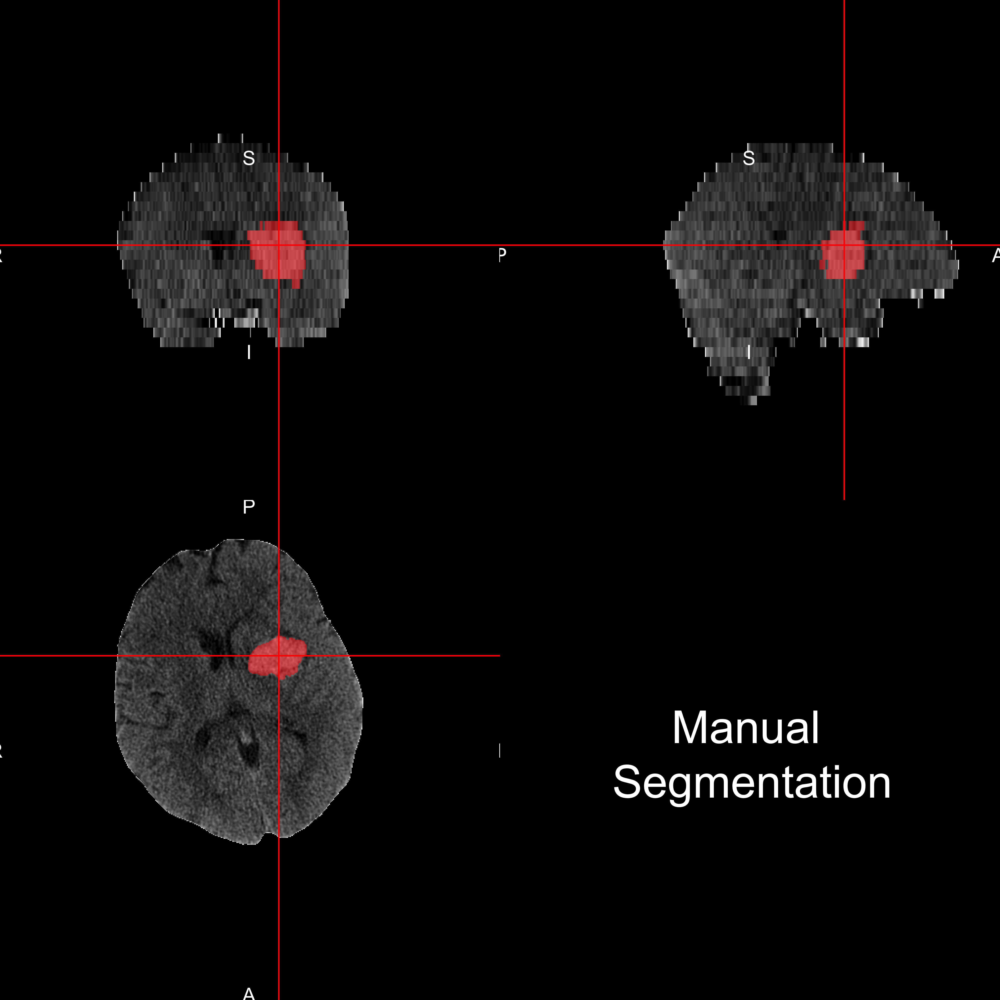

## Example Output: Automatic Segmentation
 
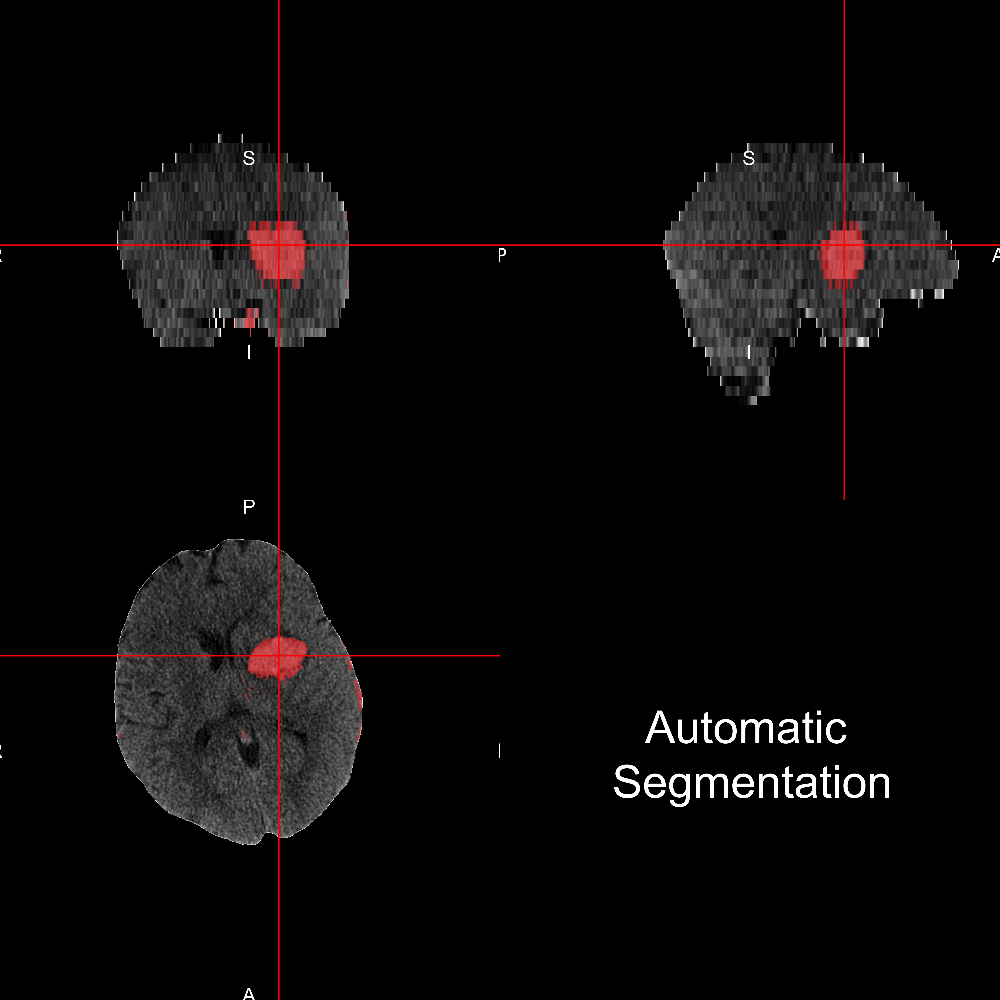

## Prediction Comparison: DSI: 0.90

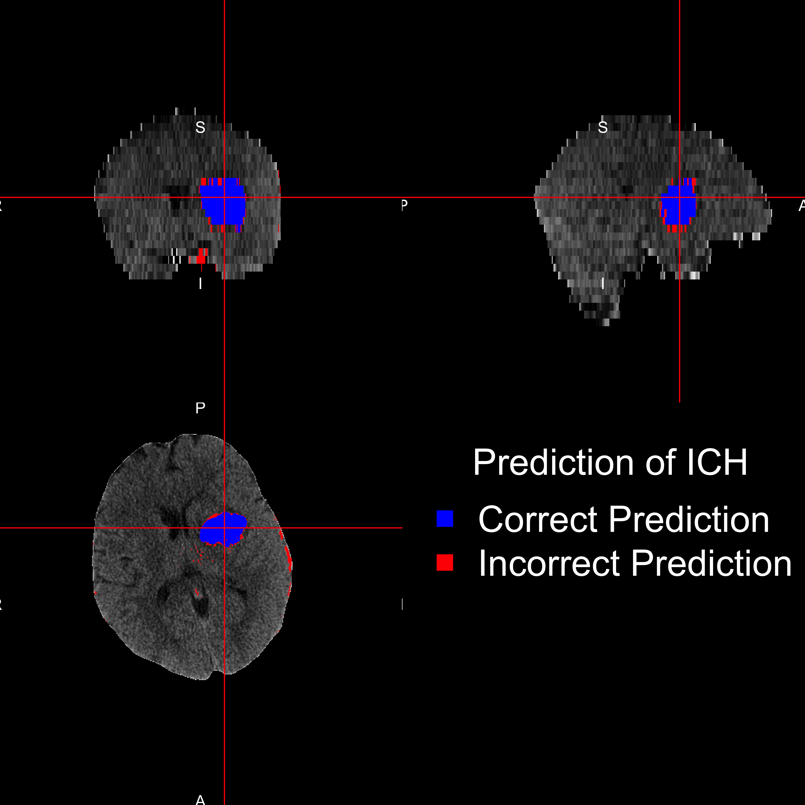

## 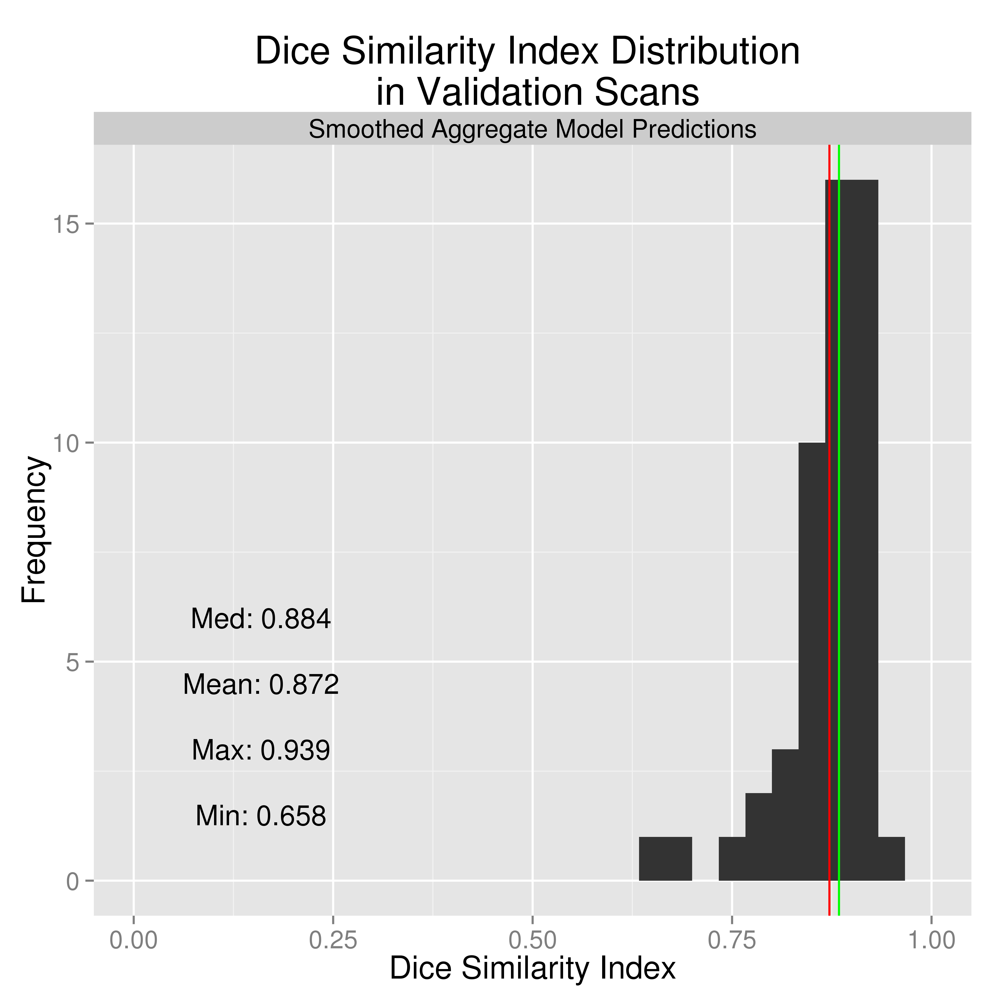

# Thanks

## Prediction Comparison: DSI: 0.686

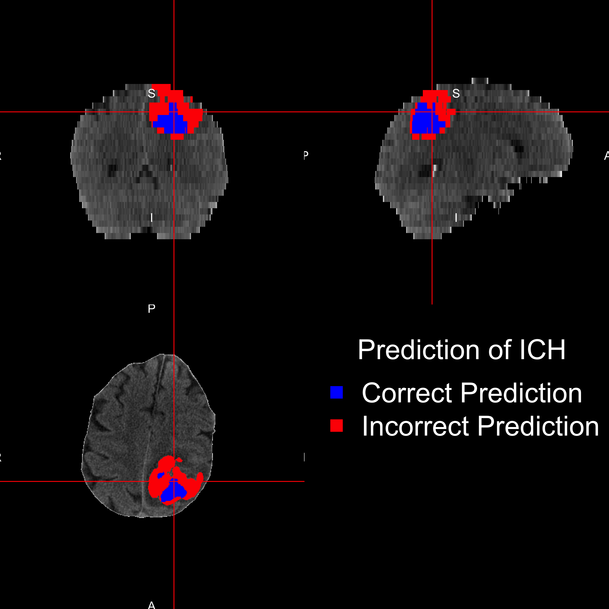

## Image Representation: voxels (3D pixels)

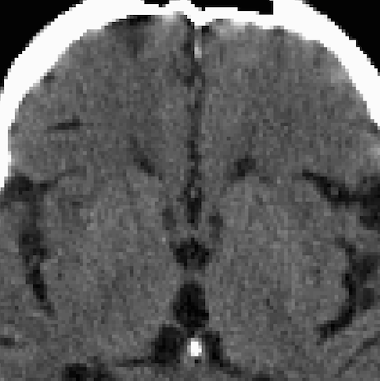

## 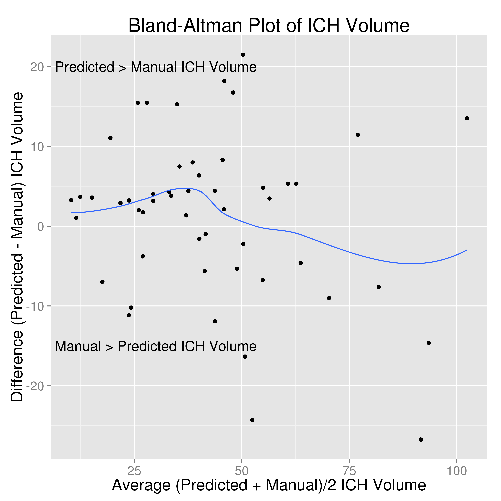

