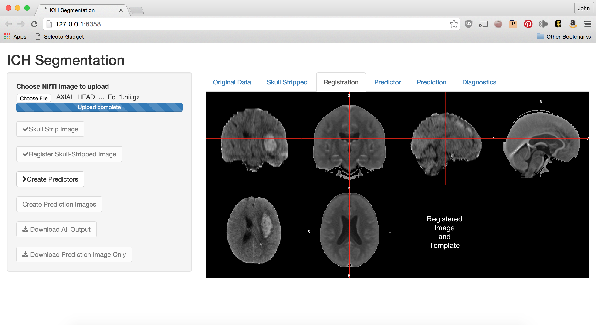
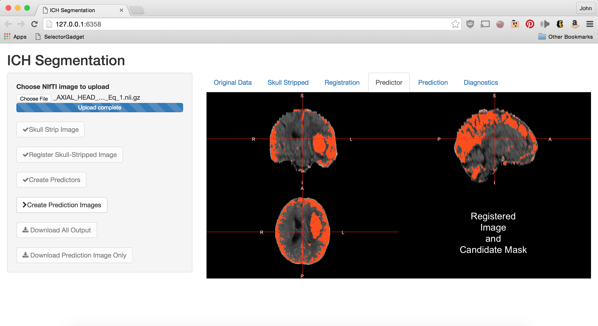

<script type="text/x-mathjax-config">
MathJax.Hub.Config({ TeX: { extensions: ["color.js"] }});
</script>

```{r opts, prompt=FALSE, echo=FALSE, message=FALSE, warning=FALSE, error=FALSE, comment=""}
library(knitr)
library(knitcitations)
opts_chunk$set(echo = FALSE, prompt = FALSE, message = FALSE, warning = FALSE, comment = "", results = 'hide')
setwd("~/CT_Registration/RIP_SlideDeck/RIP_2015_Dec/")
```


```{r, prompt=TRUE, echo=FALSE, message=FALSE, warning=FALSE}
rm.obj = ls()
rm.obj = rm.obj[ !(rm.obj %in% c("fname", "slide"))]
rm(list = rm.obj)
library(ggplot2)
library(xtable)
library(scales)
library(fslr)
library(pander)
options(stringsAsFactors = FALSE)
rootdir = path.expand("~/Dropbox/CTR/DHanley/MISTIE")
homedir = file.path(rootdir, "ICH Analysis")
Mdir = file.path(rootdir, "MISTIE DSMB Analysis")
resdir <- file.path(homedir, "results")
rundir <- file.path(resdir, "Manuscript")
progdir <- file.path(homedir, "stataprograms")
datadir <- file.path(Mdir, "statacalc")
knitdir <- "~/CT_Registration/RIP_SlideDeck/RIP_2015_Dec/"
load(file=file.path(rundir, "All_IncludingICES_Patients.Rda"))
load(file=file.path(rundir, "Randomized_Patients.Rda"))
load(file=file.path(knitdir, "111_Filenames.Rda"))
```

```{r demog}
library(tableone)
library(stargazer)
library(pander)
n.ids = length(unique(fdf$id))
demog = as.numeric(gsub("-", "", fdf$id))
demog = all.alldat[ all.alldat$patientName %in% demog, ]
stopifnot(nrow(demog) == n.ids)
demog$Diagnostic_ICH_Volume =demog$ICH_Dx_10 * 10 
demog$Diagnostic_IVH_Volume =demog$IVH_Dx_10 * 10 
vars = c("Age", "Gender",  
         "Diagnostic_ICH_Volume", "Diagnostic_IVH_Volume")
catvars = c("Gender")
tb1 = CreateTableOne(vars = vars, factorVars = catvars, 
                     data = demog)
tb1 = print(tb1, contDigits = 1)
gen = grepl("Gender", rownames(tb1))
rownames(tb1)[ gen ] = "Male: N (%)"
tb1[gen,1] = gsub("\\((.*)\\)", "(\\1%)", tb1[gen,1,drop=FALSE])

rownames(tb1) = gsub("_", " ", rownames(tb1))
rownames(tb1) = gsub(" \\(mean", ": Mean", rownames(tb1))
rownames(tb1) = gsub("(sd))", "(SD)", rownames(tb1), fixed=TRUE)
rownames(tb1) = gsub("Volume", "Volume in mL", rownames(tb1), fixed=TRUE)
rownames(tb1) = gsub("Age", "Age in Years", rownames(tb1), fixed=TRUE)
tb1 = tb1[rownames(tb1) != "n", , drop=FALSE]
# tb1 = pander.return(tb1)
# tb1 = tb1[ tb1 != ""]
```

```{r}
library(RefManageR)
library(knitcitations)
bib <- ReadBib(file.path(knitdir, 'Oral_Proposal.bib'))
x = sapply(bib, citep)
```

## What is Intracranial/Intracerebral hemorrhage?

<div class="columns-2" style='font-size: 28pt;'>
- When a blood vessel ruptures into:
    + **Tissue ⇒ intracerebral hemorrhage (ICH)**
    + Ventricles ⇒ intraventricular hemorrhage (IVH)
- ≈ 13% of strokes


<a href = "http://www.heartandstroke.com/site/c.ikIQLcMWJtE/b.3484153/k.7675/Stroke__Hemorrhagic_stroke.htm" style ="font-size:10.5px" >http://www.heartandstroke.com/site/c.ikIQLcMWJtE/b.3484153/k.7675/Stroke__Hemorrhagic_stroke.htm</a>

</div>

<!-- 
## Overall Goal of Clinical Research in Stroke

<div style='font-size: 30pt;'>
Determine for a patient with a hemorrhage:

- Which treatments are effective
- The likelihood of a good outcome
- Factors are relevant for prognosis
</div>

## Overall Goal of Clinical Research in Stroke

<div style='font-size: 30pt;'>
Determine for a patient with a hemorrhage:

- Which treatments are effective
- The likelihood of a good outcome
- **Factors are relevant for prognosis**
</div>

-->

## Overall Goal of My Work

<div style='font-size: 30pt;'>

- **Build tools** for analysis and visualization
    - Software (R packages)
- Estimate **known** factors for prognosis 
    - ICH volume
- Evaluate **unknown** factors for prognosis 
    - ICH location
</div>

# Building Tools: <br/>"Vision Without Execution <br/> is Delusion" <br/>  - Thomas Edison <br/> <br/> Build Tools You Would Use 

## Authored R Packages:

<div id="wrap">
<div id="left_col">


- **fslr** <p style='font-size: 12pt;'>(Muschelli, John, et al. "fslr: Connecting the FSL Software with R." R JOURNAL 7.1 (2015): 163-175.)</p>
- **brainR** <p style='font-size: 12pt;'>(Muschelli, John, Elizabeth Sweeney, and Ciprian Crainiceanu. "brainR: Interactive 3 and 4D Images of High Resolution Neuroimage Data." R JOURNAL 6.1 (2014): 42-48.)</p>
- **extrantsr**
- **cttools**
- **dcm2niir**
- **matlabr**
- **spm12r**


</div>
<div id="right_col">

- drammsr
- itksnapr
- papayar
- WhiteStripe
- oasis
- SuBLIME
- googleCite

</div>
</div>


## Why do I write packages in R?


- Statistical methods
- State-of-the-art reporting and reproducibility tools
- Open source
- Large community
- **Statisticians** use R more than Python  

## fslr: Overview 


<br/>
<div style='font-size: 30pt;'>
- **Seamless integration** is important
</div>

## Why FSL (other choices: AFNI/SPM)?

- Command-line based - no GUI needed
- Actively developed (first release in 2000) `r citep("jenkinson_fsl_2012")`
- Popular: 13.9% of published neuroimaging studies used FSL `r citep("carp_secret_2012")`.
- **Previous experience with the software**
- Open source and free (for academics)
- Community-standard methods/tools


## Software use: Number of Downloads (as reported by RStudio CRAN)


```{r}
if (!require(cranlogs)) {
  library(devtools)
  install_github("metacran/cranlogs")
}
library(plyr)
first_date = "2014-01-10"
today = Sys.Date()
long_today = format(Sys.time(), "%B %d, %Y")
packs = c("fslr", "brainR", "matlabr", "spm12r", "WhiteStripe")
last_week = cran_downloads( when = "last-week",
                            packages = packs)
last_week = ddply(last_week, .(package), summarise, 
                  Last_Week = sum(count))
dl = cran_downloads( from = first_date, to = today,
                     packages = packs)
dl = ddply(dl, .(package), summarise, All_Time = sum(count))
dl = arrange(dl, desc(All_Time))
dl = merge(dl, last_week)
colnames(dl)[1] = "Package"
```


```{r}
library(DT)
```

```{r, results = "asis"}
datatable(dl, filter = "none", selection = "none", rownames = FALSE,
          options = list(dom = 't', autoWidth = TRUE,
                         columnDefs = list(list(
                           className = 'dt-center',
                           targets = 0)))
)
```


## Segment ICH Volume for Prognostic Models

<div class="columns-2">

Want to go from this


To this:

</div>

# Larger ICH Volume ⇒ Worse Outcome

```{r biblio, results='hide'}
bibliography() 
```

<!-- NEED ABC/2 data-->


## Stroke Trial Data

* Intracerebral (bleeds mainly in tissue, <strong>ICH</strong>) or Intraventricular (bleeds into ventricles, <strong>IVH</strong>) Hemorrhage trials

* Minimally Invasive Surgery plus rt-PA for ICH Evacuation (<strong>MISTIE</strong>) 

- Multi-center, multi-national Phase II clinical trial


* http://braininjuryoutcomes.com/mistie-about


## Measure ICH using Computed Tomography (CT)
<div class="notes">
Images are acquired from an X-ray scanner.  
x-ray goes around object and detector the other side of the object determines how many x-rays are recovered 
- fancy transform
- Image!
</div>
<div style="width:48%;float:left;">

<br>
<sub><sup><sub><sup>Image from http://www.cyberphysics.co.uk/topics/medical/CTScanner.htm</sup></sub></sup></sub>
</div>
<div style="margin-left:48%;">

</div>


## Image Representation: voxels (3D pixels)
<div class="columns-2">

<br>


<p style='font-size: 10pt;'>Muschelli, John, Elizabeth Sweeney, and Ciprian Crainiceanu. "brainR: Interactive 3 and 4D Images of High Resolution Neuroimage Data." R JOURNAL 6.1 (2014): 42-48.</p>
</div>


## CT scan Characteristics
<div class="notes">
- This is an example of a CT scan of a brain with no pathology
- Note the bone
An attenuation coefficient characterizes how easily the X-ray beam penetrated that area of the brain.
</div>

<div class="columns-2"  style='font-size: 22pt;'>


* Voxel intensities are in Hounsfield Units (HU), which are "standardized"
$$
HU(v) = 1000 \times \frac{\mu(v) - \mu_{\text{water}}}{ \mu_{\text{water}}- \mu_{\text{air}}}
$$
- $\mu$ is the linear attenuation coefficient and $v$ denotes voxel.
* $\mu_{\text{water}}$ and $\mu_{\text{air}}$ are calibrated from each scanner.
</div>


## CT scan Characteristics 
<div class="notes">
- Here are the HU ranges for stuff
</div>

<div class="columns-2" style='font-size: 22pt;'>


Standard HU Ranges:

* Bone – high intensity (1000 HU)
* Air – low intensity (-1000 HU)
* Water - 0 HU
* Blood 30-80 HU
* White/Gray Matter ≈ 0 - 100 HU
</div>


## CT scan Characteristics: Measures Human + Room + FOV


## CT is NOT MRI (specifically not T1/T2)

```{r procon, results='asis', echo=FALSE, warning=FALSE, message = FALSE}
ct <- c("Diagnostic", "Houndsfield Units", "*One* exists", "Measures humans/rooms/beds", "Sparse")
mri <- c("Diagnostic/Research", "Arbitrary", "MNI Standard", "Measures Humans", "Many")
names <- c("Domain", "Units", "Template", "Measures", "Methods")

df <- data.frame(CT=ct, MRI=mri)
rownames(df) <- names
pander(df)
```


## ICH Prediction - Training data

* ICH are manually traced (**gold standard**)


## Problems with Manual Segmentation

* ICH are manually traced (**gold standard**)
* Time-consuming
* Within and across-rater variability
* Not feasible for for large databases
* Hard to use for enrollment criteria (adaptive randomization)


## Preprocessing: CT Skull Stripping

Muschelli, John, et al. "Validated automatic brain extraction of head CT images." NeuroImage 114 (2015): 379-385. [R Code to Run It!](bit.ly/CTBET_RCODE)

<div class="columns-2">


</div>


# Imaging Predictors

## Local Moment Information: Neighborhoods

<div class="columns-2">

<br>


## Local Moment Information: Mean

For each voxel,  neighborhood $N(v)$, of all adjacent neighboring voxels in $3$ dimensions.  Let $x_k(v)$ denote the voxel intensity in HU for voxel neighbor $k$, where $k = 1, \dots, 27$. 
$$
\begin{equation}
\bar{x}(v) = \frac{1}{N(v)} \sum_{k \in N(v)} x_k(v) \label{eq:mean}
\end{equation}
$$


## Local Moment Information: Higher Moments


## Population Voxel-wise Mean/SD Image
From $32$ CT images from Dr. Rorden (personal communication), we created a voxel-wise mean image $M$ and voxel-wise standard deviation $S$ image, after registering to a CT template `r citep("rorden_age-specific_2012")`.  


## Standardized-to-template Intensity
We created a standardized voxel intensity with respect to the template ($z_{i,\text{template}}$) using the following equation:
<div id="wrap">
<div id="left_col2">
<br>
<br>

$$
z_{i,\text{template}}(v) = \frac{x_{i}(v) - M(v)}{S(v)}
$$
</div>

<div id="right_col2">


</div>
</div>


## Covariates   


## Model Fitting 

* Case-control sample voxels for a fixed percentage (25%) of outcome


Let $y_{i}(v)$ be the presence / absence of ICH for voxel $v$ from person $i$.  

General model form: 
$$
\text{logit}\left(y_{i}(v)\right) = f(X)
$$

## Models Fit on the Training Data

- Logistic Regression: \(f(X) = \beta_0 + \sum_{k= 1}^{p} x_{i, k}(v)\beta_{k}\)
- Generalized Additive Models `r citep("hastie_generalized_1990")`
- LASSO `r citep(c("tibshirani_regression_1996", "friedman_regularization_2010"))`: 
$$ L(f(X)) \propto \beta_0 + \sum_{k= 1}^{p} x_{i, k}(v) \beta_{k} + \lambda \sum_{k= 1}^{p}
$$
- Random Forests `r citep(c("randomForest", "breiman2001random"))`
<div class="centerer">
\(f(X) \propto\) 
</div>

```{r, }
pngname = file.path(knitdir, "figure", "Breakdown.png")
png(pngname, height=3, width=6, units="in", res=600)
par(oma = rep(0, 4), mar=c(0, 0, 0, 0))
plot(c(290, 400), c(100, 200),  type= "n", xlab="", ylab="", xaxt = "n",
     yaxt = "n", bty="n")
rect(290, 100, 400,  200,  col = "red", border=NA) # transparent
rect(310, 100, 400,  200,  col = "blue", border=NA) # transparent
rect(350, 100, 400,  200,  col = "green", border=NA) # transparent
legend(x = 300, y = -1, legend= c("Training", "Validation", "Test"))
tcol = "black"
text.cex = 1.5
text(x = 300, y = 150, labels = "10", col=tcol, cex=text.cex)
text(x = 300, y = 140, labels = "Train", col=tcol, cex=text.cex)
text(x = 300, y = 130, labels = "+", col=tcol, cex=text.cex)
text(x = 300, y = 120, labels = "Cutoff", col=tcol, cex=text.cex)
text(x = 327.5, y = 150, labels = "51", col="white", cex=text.cex)
text(x = 327.5, y = 140, labels = "Validate", col="white", cex=text.cex)
text(x = 375, y = 150, labels = "51", col=tcol, cex=text.cex)
text(x = 375, y = 140, labels = "Test", col=tcol, cex=text.cex)
dev.off()
```


## Assessing Performance 
For each validation scan we can calculate the following 2-by-2 table, where the cells represent number of voxels and a corresponding Venn diagram:

<div style="width:45%;float: left;">
```{r, results='hide'}
mat = matrix(c("TN", "FN", "FP", "TP"), ncol=2, byrow=2)
colnames(mat) = rownames(mat) = c(0, 1)
names(dimnames(mat)) = c("PitCH", "Manual")
pander(mat, style="grid")
```

<table class = 'rmdtable' style='font-size: 26px;'>
<tr class = "header"><td></td><td></td><td colspan="2">Manual</td></tr>
<tr class = "header"><td></td><td></td><td>0</td><td>1</td></tr>
<tr><td rowspan="2"> PitCH</td><td>0</td><td style='font-size: 40px;'>TN</td><td style="color:blue">FN</td></tr>
<tr><td>1</td><td style="color:red">FP</td><td style="color:purple">TP</td></tr>
</table>
</div>

<div style="margin-left:48%;">

</div>

## Dice Similarity

<div style="width:48%;float:left;">
We calculate the Dice Similarity Index (DSI):
$$
\definecolor{red}{RGB}{255,0,0}
\definecolor{blue}{RGB}{0,0,255}
\definecolor{purple}{RGB}{128,0,128}
\definecolor{blac,}{RGB}{0,0,0}
\frac{ \color{purple} 2 \times \#  \text{TP} }{ \color{purple}  2 \times \#\text{TP} \color{black} + \color{red} \text{FN} \color{black} + \color{blue} \text{FP}} 
$$

- 0 indicates no overlap
- 1 means perfect agreement  
</div>

<div style="margin-left:48%;">


</div>

## 

## Patient with High Dice: Manual Segmentation


## Patient with High Dice: Automatic Segmentation


## Patient with High Dice: DSI = 0.90
```{r, eval=FALSE}
#dice.mod.dice[which(fdf$id == '161-413'),'mod_agg']
```


## Patient with Median Dice Overlap 

  


## 

## Easy Alternatives Exist (ABC/2)

* ABC/2 - an ellipsoid approximation based on 3 measurements
    - Use largest cross section of ICH - measure long axis (A)
    - Measure axis orthogonal to it (B)
    - Count in the up/down direction how many slices ICH (C)
* "Radiologists and non-radiologists alike can estimate ICH size without the need for volumetric 3D analysis from CT or radiology software, which many non-radiologists are unfamiliar with." - http://www.mdcalc.com/abc2-formula-for-intracerebral-hemorrhage-volume/

## Easy Alternatives Exist (ABC/2)

* Has large errors when not contiguous `r citep("divani_abcs_2011")`
    - Can have high inter- and intra-reader variability `r citep("hussein_reliability_2013")`
    - ABC/2 also been shown to consistently **over-estimate** infarct volume `r citep("pedraza_reliability_2012")`
    - AND also **under-estimate** ICH volume `r citep("maeda_hematoma_2013")`
* Can't determine location
* Can't use imaging methods

    
## 

## 

## 

## 

## 


## ICH Segmentation Conclusions

<div style="font-size: 24pt">

- Large ICH can be segmented using CT
- Simple methods can be used for voxel-wise segmentation
- A small training set can be used
- Feature selection is important
- All the analysis can be done in R

</div>


## Population-level Distribution of ICH


## Regress ROIs against stroke severity scores 


## Breakdown of Severity Areas Engaged 

<div style="font-size: 12pt">
```{r, results = "asis"}
load("all_breakdown.rda")
datatable(df, filter = "none", selection = "none", rownames = FALSE,
          options = list(dom = 't', autoWidth = TRUE,
                         columnDefs = list(list(
                           className = 'dt-center',
                           targets = 0:3),
                           list(width = '200px', targets = 1),
                           list(width = '150px', targets = c(2:3))
                         )
          )
)
```
</div>


## ICH Segmentation Conclusions

<div style="font-size: 24pt">

- Automatic segmentation allow for population-level analysis
    - Allows for a more quantative description of how "close" 2 trials are with respect to hemorrhage
    

- Voxel-wise regression can show regions associated with severity
    - These regions need to be validated (MISTIE III)
    

</div>


# Thank You


## Subject Data used: 111 scans (1 per patient)
<div id="wrap">
<div id="left_col">

```{r, results='asis'}
x = pandoc.table.return(tb1, style="rmarkdown", split.table = Inf)
cat(x)
```

</div>
<div id="right_col"  style='font-size: 24pt;'>


- Adults (inclusion criteria 18-80 years old)
- Large ICH areas
- Small Intraventricular Hemorrhages (IVH)
</div>

</div>


## Global Head Information: Smoothed Images

Smoothing the original image using large Gaussian kernels ($\sigma = 5mm^3,10mm^3, 20mm^3$) can capture any potential homogeneity throughout the scan.  

<div class="container">
   <div class="column-center">
   $\sigma = 10$

</div>
   <div class="column-left">
   $\sigma = 5$

</div>
   <div class="column-right">
   $\sigma = 20$

   </div>
</div>


## Larger ICH ⇒ Worse Outcome
<div style="font-size: 14pt; color:black;">
<br>
J. P. Broderick, T. G. Brott, J. E. Duldner, et al. **"Volume of intracerebral hemorrhage. A powerful and easy-to-use predictor of 30-day mortality."** In: _Stroke_ 24.7 (1993), pp. 987-993.

S. Davis, J. Broderick, M. Hennerici, et al. **"Hematoma growth is a determinant of mortality and poor outcome after intracerebral hemorrhage"**. In: _Neurology_ 66.8 (2006), pp. 1175-1181.

L. C. Jordan, J. T. Kleinman and A. E. Hillis. **"Intracerebral hemorrhage volume predicts poor neurologic outcome in children"**. In:
_Stroke_ 40.5 (2009), pp. 1666-1671.

S. Tuhrim, D. R. Horowitz, M. Sacher, et al. **"Volume of ventricular blood is an important determinant of outcome in supratentorial intracerebral hemorrhage"**. In: _Critical care medicine_ 27.3 (1999),
pp. 617-621.
</div>
