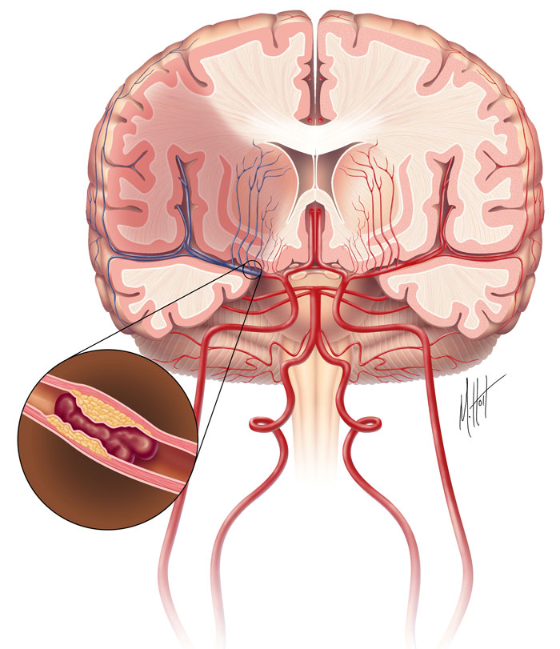
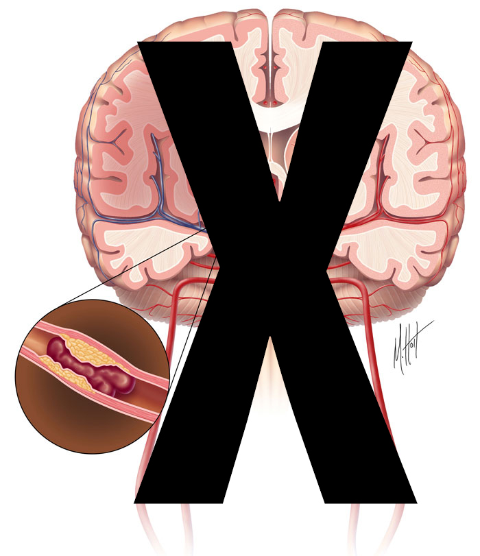
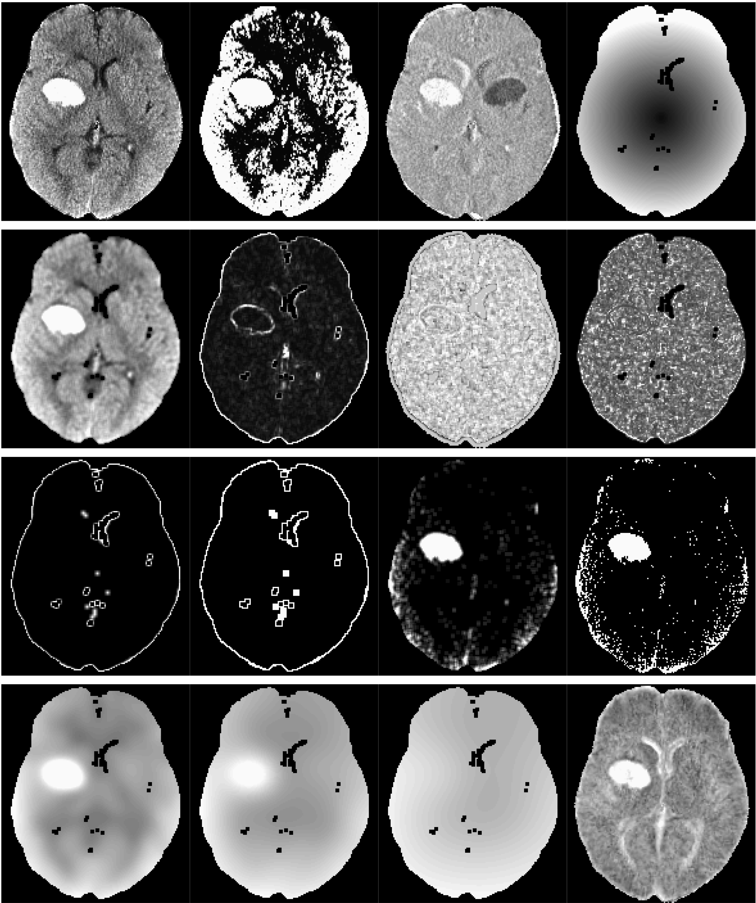
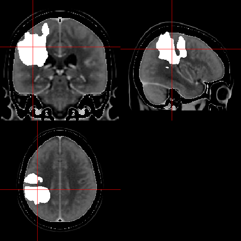
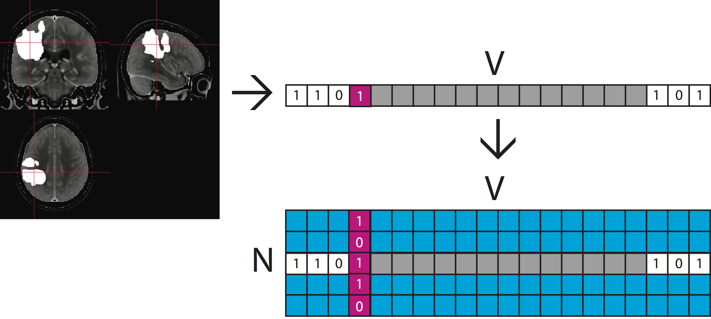
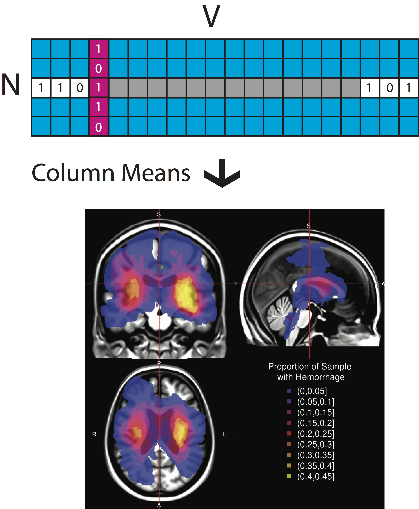
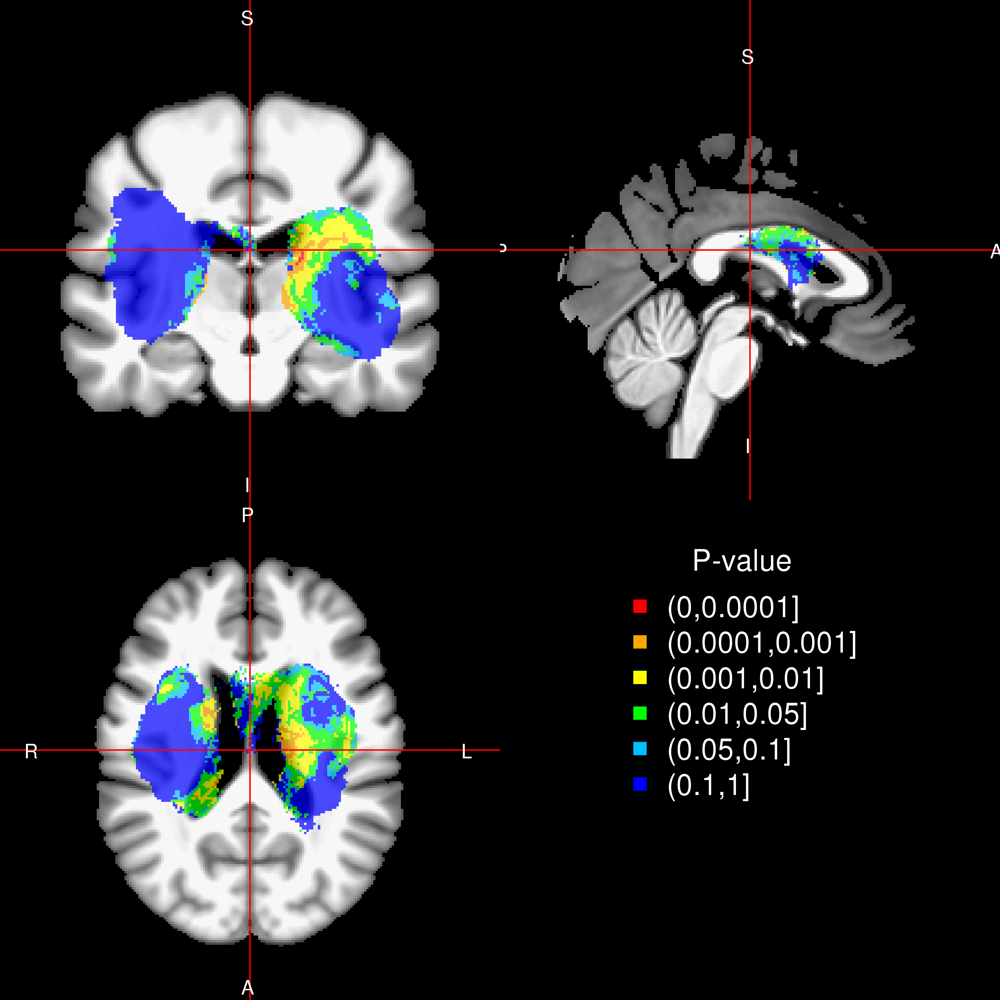
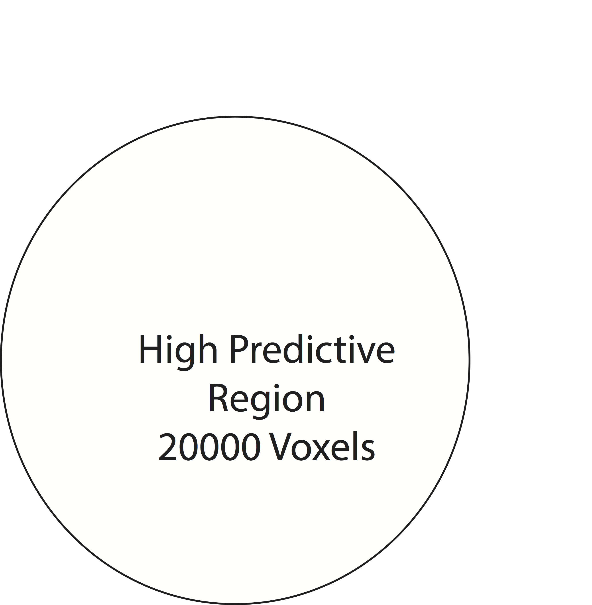
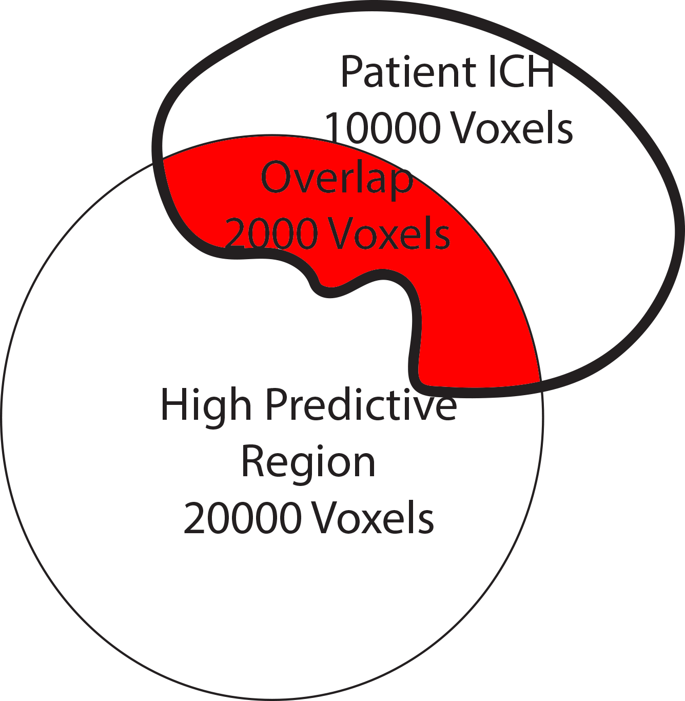

<script type="text/x-mathjax-config">
MathJax.Hub.Config({ TeX: { extensions: ["color.js"] }});
</script>

```{r opts, prompt=FALSE, echo=FALSE, message=FALSE, warning=FALSE, error=FALSE, comment=""}
library(knitr)
library(knitcitations)
cite_options(max.names = 1)
opts_chunk$set(echo = FALSE, prompt = FALSE, message = FALSE, warning = FALSE, comment = "", results = 'hide')
setwd("~/CT_Registration/RIP_SlideDeck/RIP_2015_Dec/")
```


```{r, prompt=TRUE, echo=FALSE, message=FALSE, warning=FALSE}
rm.obj = ls()
rm.obj = rm.obj[ !(rm.obj %in% c("fname", "slide"))]
rm(list = rm.obj)
library(ggplot2)
library(xtable)
library(scales)
library(fslr)
library(pander)
options(stringsAsFactors = FALSE)
rootdir = path.expand("~/Dropbox/CTR/DHanley/MISTIE")
homedir = file.path(rootdir, "ICH Analysis")
Mdir = file.path(rootdir, "MISTIE DSMB Analysis")
resdir <- file.path(homedir, "results")
rundir <- file.path(resdir, "Manuscript")
progdir <- file.path(homedir, "stataprograms")
datadir <- file.path(Mdir, "statacalc")
knitdir <- "~/CT_Registration/RIP_SlideDeck/RIP_2015_Dec/"
load(file=file.path(rundir, "All_IncludingICES_Patients.Rda"))
load(file=file.path(rundir, "Randomized_Patients.Rda"))
load(file=file.path(knitdir, "111_Filenames.Rda"))
pt.ids = c(100318L, 100362L, 100365L, 101306L, 101307L, 101308L, 102317L, 
102322L, 102324L, 102331L, 102360L, 102367L, 102374L, 102391L, 
102393L, 102403L, 102406L, 120376L, 131310L, 131316L, 131334L, 
131354L, 133409L, 133417L, 134304L, 134305L, 134320L, 134327L, 
134345L, 134380L, 134381L, 134382L, 134392L, 134408L, 134412L, 
134416L, 152302L, 152303L, 152353L, 157328L, 157329L, 157332L, 
157335L, 157336L, 157370L, 157372L, 157399L, 157410L, 161413L, 
173312L, 173313L, 173325L, 173341L, 173361L, 173364L, 173368L, 
173384L, 173396L, 173404L, 175387L, 175397L, 175405L, 179373L, 
179383L, 179386L, 179394L, 179395L, 179402L, 184388L, 191301L, 
191311L, 191314L, 191315L, 191319L, 191321L, 191333L, 191375L, 
191400L, 205509L, 205517L, 205519L, 216390L, 219350L, 222337L, 
222357L, 222358L, 223355L, 223369L, 223407L, 225502L, 225503L, 
225504L, 225505L, 225506L, 225507L, 225510L, 225511L, 225515L, 
225524L, 230356L, 230363L, 230366L, 230371L, 230377L, 232514L, 
232516L, 234385L, 265389L, 265398L, 289518L, 289525L)
fdf$id = as.numeric(gsub("-", "", fdf$id))
fdf = fdf[ fdf$id %in% pt.ids, ]
```

```{r demog}
library(tableone)
library(stargazer)
library(pander)
library(plyr)
alldemog = read.csv("All_180_FollowUp_wDemographics.csv", as.is = TRUE)
alldemog = alldemog[, c("patientName", "Clot_Location_RC")]
alldemog$Clot_Location_RC = plyr::revalue(
  alldemog$Clot_Location_RC,
  c("Globus Palidus" = "Globus Pallidus"))
n.ids = length(unique(fdf$id))
demog = fdf$id 

demog = all.alldat[ all.alldat$patientName %in% demog, ]
demog$Clot_Location_RC = NULL
demog = merge(demog, alldemog, all.x = TRUE )
stopifnot(nrow(demog) == n.ids)
demog$Diagnostic_ICH_Volume =demog$ICH_Dx_10 * 10 
demog$Diagnostic_IVH_Volume =demog$IVH_Dx_10 * 10 
tt = sort(table(demog$Clot_Location_RC), decreasing = TRUE)
nclot = names(tt)[tt > 0]
demog$Clot_Location_RC = factor(demog$Clot_Location_RC, levels = nclot)

vars = c("Age", "Gender", "Clot_Location_RC",
         "Diagnostic_ICH_Volume")
catvars = c("Gender", "Clot_Location_RC")
tb1 = CreateTableOne(vars = vars, factorVars = catvars, 
                     data = demog)
tb1 = print(tb1, contDigits = 1)
gen = grepl("Gender", rownames(tb1))
rownames(tb1)[ gen ] = "Male: N (%)"
tb1[gen,1] = gsub("\\((.*)\\)", "(\\1%)", tb1[gen,1,drop=FALSE])

rownames(tb1) = gsub("_", " ", rownames(tb1))
rownames(tb1) = gsub(" \\(mean", ": Mean", rownames(tb1))
rownames(tb1) = gsub("(sd))", "(SD)", rownames(tb1), fixed=TRUE)
rownames(tb1) = gsub("Volume", "Volume in mL", rownames(tb1), fixed=TRUE)
rownames(tb1) = gsub("Diagnostic", "", rownames(tb1), fixed=TRUE)
rownames(tb1) = gsub("Age", "Age in Years", rownames(tb1), fixed=TRUE)
rownames(tb1) = gsub("Clot_Location_RC", "ICH Location", rownames(tb1), fixed=TRUE)
tb1 = tb1[rownames(tb1) != "n", , drop=FALSE]
# tb1 = pander.return(tb1)
# tb1 = tb1[ tb1 != ""]
```

```{r}
library(RefManageR)
library(knitcitations)
bib <- ReadBib(file.path(knitdir, 'Oral_Proposal.bib'))
x = sapply(bib, citep)
```


## Overview of Work/Research

<div style='font-size: 28pt;'>
- Neuroimaging and R
- Segmentation/Classification of Computed Tomography (CT) scans
    - Brain segmentation
    - Hemorrhage segmentation
- Quantitative hemorrhage localization
</div>

## Overview of Work/Research

<div style='font-size: 28pt;'>
- Neuroimaging and R
- Segmentation/Classification of Computed Tomography (CT) scans
    - Brain segmentation
    - Hemorrhage segmentation
- **Quantitative hemorrhage localization**
</div>

# Neuroimaging and R: <br/> <br/> Creating Tools I Would Use 

## Authored R Packages:

<div id="wrap">
<div id="left_col">

- **fslr** <p style='font-size: 12pt;'>(Muschelli, John, et al. "fslr: Connecting the FSL Software with R." R JOURNAL 7.1 (2015): 163-175.)</p>
- brainR <p style='font-size: 12pt;'>(Muschelli, John, Elizabeth Sweeney, and Ciprian Crainiceanu. "brainR: Interactive 3 and 4D Images of High Resolution Neuroimage Data." R JOURNAL 6.1 (2014): 42-48.)</p>
- extrantsr
- ichseg
- dcm2niir
- matlabr
- spm12r


</div>
<div id="right_col">

- drammsr
- itksnapr
- papayar
- WhiteStripe
- oasis
- SuBLIME
- googleCite
- diffr
- rscopus

</div>
</div>


```{r, cache= FALSE}
if (!require(cranlogs)) {
  library(devtools)
  install_github("metacran/cranlogs")
}
first_date = "2014-01-10"
today = Sys.Date()
long_today = format(Sys.time(), "%B %d, %Y")
packs = c("fslr", "brainR", "matlabr", "spm12r", "WhiteStripe", "diffr", "oasis", "rscopus")
last_week = cran_downloads( when = "last-week",
                            packages = packs)
last_week = ddply(last_week, .(package), summarise, 
                  Last_Week = sum(count))
dl = cran_downloads( from = first_date, to = today,
                     packages = packs)
dl = ddply(dl, .(package), summarise, All_Time = sum(count))
dl = merge(dl, last_week)
dl = plyr::arrange(dl, desc(Last_Week))
colnames(dl) = c("Package", "All Time", "Last Week")
```


## Number of Downloads (CRAN packages)

From the `cranlogs` R package:


```{r, cache= TRUE}
if (!require(cranlogs)) {
  library(devtools)
  install_github("metacran/cranlogs")
}
first_date = "2014-01-10"
today = Sys.Date()
long_today = format(Sys.time(), "%B %d, %Y")
packs = c("fslr", "brainR", "matlabr", "spm12r", "WhiteStripe", "diffr", "oasis", "rscopus")
last_week = cran_downloads( when = "last-week",
                            packages = packs)
last_week = ddply(last_week, .(package), summarise, 
                  Last_Week = sum(count))
dl = cran_downloads( from = first_date, to = today,
                     packages = packs)
dl = ddply(dl, .(package), summarise, All_Time = sum(count))
dl = merge(dl, last_week)
dl = plyr::arrange(dl, desc(Last_Week))
colnames(dl) = c("Package", "All Time", "Last Week")
```


```{r}
library(DT)
```

```{r, results = "asis", eval = TRUE}
datatable(dl, filter = "none", selection = "none", rownames = FALSE,
          options = list(dom = 't', autoWidth = TRUE,
                         columnDefs = list(list(
                           className = 'dt-center',
                           targets = 0)))
)
```

```{r outtab, results='asis', eval = FALSE}
pander(dl)
```

# Neuroimaging Analysis in Stroke

## The MISTIE Stroke Trial 

* Minimally Invasive Surgery plus r-tPA for Intracerebral Hemorrhage Evacuation (<strong>MISTIE</strong>) 
    - Multi-center, multi-national Phase II clinical trial
* Patients with intracerebral hemorrhages (≥ 20 millilters)


* http://braininjuryoutcomes.com/mistie-about


## When I stroke I don't mean ischemic

<div class="container">
<div id="left_col">

</div>
<div id="right_col">

- Ischemic stroke - clot blocks oxygen/nutrients
- Tissue dies

<p style = "font-size:10.5px;">
Image from <a href = "http://www.strokecenter.org/patients/about-stroke/ischemic-stroke/
" style ="word-wrap: break-word;" >http://www.strokecenter.org/patients/about-stroke/ischemic-stroke/
</a>
</p>
</div>
</div>


## When I stroke I don't mean ischemic

<div class="container">
<div id="left_col">

</div>
<div id="right_col">

- Ischemic stroke - clot blocks oxygen/nutrients
- Tissue dies

<p style = "font-size:10.5px;">
Image from <a href = "http://www.strokecenter.org/patients/about-stroke/ischemic-stroke/
" style ="word-wrap: break-word;" >http://www.strokecenter.org/patients/about-stroke/ischemic-stroke/
</a>
</p>
</div>
</div>


## What is Intracranial/Intracerebral hemorrhage?

<div class="columns-2" style='font-size: 28pt;'>
- When a blood vessel ruptures into:
    + **Tissue ⇒ intracerebral hemorrhage (ICH)**
- ≈ 13% of strokes


<p style = "font-size:10.5px; ">
<a href = "http://www.heartandstroke.com/site/c.ikIQLcMWJtE/b.3484153/k.7675/Stroke__Hemorrhagic_stroke.htm" style ="word-wrap: break-word;" >http://www.heartandstroke.com/site/c.ikIQLcMWJtE/b.3484153/k.7675/Stroke__Hemorrhagic_stroke.htm</a>
</p>

</div>


## X-ray Computed Tomography (CT) Scans
<div class="notes">
Images are acquired from an X-ray scanner.  
x-ray goes around object and detector the other side of the object determines how many x-rays are recovered 
- fancy transform
- Image!
</div>
<div style="width:48%;float:left;">
<sub><sup><sub><sup>Image from http://www.cyberphysics.co.uk/topics/medical/CTScanner.htm</sup></sub></sup></sub>

<br>
</div>
<div style="margin-left:48%;">

</div>


## Terminology: Neuroimaging to Data/Statistics

<div style="font-size: 26pt">
* Segmentation ⇔ classification 
* Image ⇔ 3-dimensional array
* Mask/Region of Interest ⇔ binary (0/1) image 
* Registration ⇔  Spatial Normalization/Standarization
    - "Lining up" Brains
</div>


# Brain Segmentation of CT Scans

## Problem: CT Scans Capture **Everything**


## Brain Segmentation of CT Scans


<div class="columns-2">
Want to go from an image:

<br/>

</div>

## Brain Segmentation of CT scans


<div class="columns-2">
Want to go from an image:

<br/>
To a brain-extracted image:

</div>

## Publicly Available code

* Muschelli, John, et al. "Validated automatic brain extraction of head CT images." NeuroImage 114 (2015): 379-385. 
* R code: http://bit.ly/CTBET_RCODE - based on **fslr** 
* bash code: http://bit.ly/CTBET_BASH


# Larger ICH Volume ⇒ Worse Outcome

```{r biblio, results='hide'}
bibliography() 
```


## ICH Segmentation, Volume/Location Estimation 

<div class="columns-2">
Want to go from a brain image:

<br/>
To a binary hemorrhage mask:

</div>


## Subject Data used: 111 scans (1 per patient)
<div id="wrap">
<div id="left_col">

```{r, results='asis', cache=FALSE}
tb1 = cbind(rownames(tb1), tb1)
rownames(tb1) = NULL
tb1[,1] = gsub("   ", "&nbsp;&nbsp;&nbsp;", tb1[,1])
ind = grepl("Clot Location", tb1[,1])
tb1[ind,1] = gsub("RC", "", tb1[ind,1])
tb1[ind,1] = gsub("^Clot", "Reader-Based Clot", tb1[ind,1])
pander(tb1, justify = c("lr"))
```

</div>
<div id="right_col"  style='font-size: 24pt;'>


- Adults (inclusion criteria 18-80 years old)
- Mostly males
- Reader-classified Location of Hemorrhage

</div>

</div>

## Image Representation: voxels (3D pixels)
<div class="columns-2">

<br>


<p style='font-size: 10pt;'>Muschelli, John, Elizabeth Sweeney, and Ciprian Crainiceanu. "brainR: Interactive 3 and 4D Images of High Resolution Neuroimage Data." R JOURNAL 6.1 (2014): 42-48.</p>
</div>

## Step 1: Create Predictors of ICH   

## Data Structure for One Patient <br/>   

---

<div class="container"> 
<div id="left_col2"> 
  <h2>Step 2: Aggregate Data</h2>
  Training Data Structure
  
  * Stack together 10 randomly selected patients
  * Train model/classifier on this design matrix

  
  </div>    
  <div id="right_col2">
    
  </div> 
</div>


## Step 3: Fit Models / Classifier

Let $y_{i}(v)$ be the presence / absence of ICH for voxel $v$ from person $i$.  

General model form: 
$$
 P(Y_{i}(v) = 1)  \propto f(X_{i}(v))
$$

## Models Fit on the Training Data

- Logistic Regression: \(f(X_{i}(v)) = \text{expit} \left\{ \beta_0 + \sum_{k= 1}^{p} x_{i, k}(v)\beta_{k}\right\}  \)
- Generalized Additive Model `r citep("hastie_generalized_1990")` 
    - fit using thin plate splines
- LASSO `r citep(c("tibshirani_regression_1996", "friedman_regularization_2010"))`: 
$$ \mathcal{L}\left(\left.Y_{i}(v) \right|\, f(X_i(v))\right) \propto \beta_0 + \sum_{k= 1}^{p} x_{i, k}(v) \beta_{k} + \lambda \sum_{k= 1}^{p} \left|\beta_{k}\right|
$$
- Random Forests `r citep(c("randomForest", "breiman2001random"))`
<div class="centerer">
\(f(X_{i}(v)) \propto\) 
</div>

## Predicted Volume Estimates True Volume 

## Predicted Volume Estimates True Volume 

## Patient with Median Overlap in Validation Set

 

## Shiny Application: http://bit.ly/ICH_SEG 

# Quantitative Hemorrhage Localization


## Localization Goals

<div style="font-size: 24pt">

1. Quantify of hemorrhage engagement of regions in the brain
2. Create a 3-dimensional (3D) density map of hemorrhages in MISTIE population
3. Determine if differences in location relate to stroke severity
4. Generate a stroke region of engagement using within-sample validation
</div>


## Register CT Image to Template

<div class="container">
   <div class="left-half">
   Original Image with Hemorrhage:
   
   </div>
   <div class="right-half">
   Template Image:   
   
   </div>
</div>

## Transformed Masks in Template Space 

<div class="container">
   <div class="left-half">
   Registered Image with Hemorrhage:
   
   </div>
   <div class="right-half">
   Registered Hemorrhage Mask:   
   
   </div>
</div>


## Hemorrhage Engagement of Brain Regions 


We can compare the area to the "Eve" segmentation map `r citep("oishi_human_2008")` which outlines structures:


## Hemorrhage Engagement of Brain Regions 
From this, we can calculate region-level engagement:
$$
\text{Engagement}_r = \frac{ \sum\limits_{\text{Voxels in region r}} \text{Hemorrhage Mask} } {\sum \text{Hemorrhage Mask}} \times 100\% \nonumber
$$

```{r}
df = read.table("Subject_Table.txt", stringsAsFactors = FALSE)
df$Area = gsub("WM", "White Matter", df$Area)
proper = function(x){
  substring(x, 1, 1) <- toupper(substring(x, 1, 1))
  substring(x, 2) <- tolower(substring(x, 2))
  x
}
df$Area = proper(df$Area)
```

```{r, results='asis'}
pander(df)
```

- Can also give region engagement (e.g. 10\% of putamen engaged)
    - putamen, caudate, and globus pallidus not engaged 


# Population ICH Distribution


## Aggregating Multiple Hemorrhage Masks

N - number of patients, V - number of voxels



## Creating a Population-level ICH Distribution



## Population ICH Distribution


```{r, eval = FALSE}
n = 5
load("Population_Table.Rda")
pop.tab = head(col.dfs$EVE_1, n)
pop.tab = pop.tab[, c("Area", "EVE_1")]
pop.tab$EVE_1 = sprintf("%02.1f", pop.tab$EVE_1)

names(pop.tab) = c("Area", "Population Engagement")
pop.tab$Area = revalue(pop.tab$Area, c("Ventricles" = "Background"))
df = pop.tab
# df = merge(pop.tab, nihss.tab, sort=FALSE, all = TRUE)
# df = merge(df, gcs.tab, sort=FALSE, all = TRUE)


proper = function(x){
  substring(x, 1, 1) <- toupper(substring(x, 1, 1))
  substring(x, 2) <- tolower(substring(x, 2))
  x
}

df$Area = proper(df$Area)
df$Area = revalue(df$Area, c("Background" = "CSF (ventricular & subarachnoid spaces)"))
df$Area = revalue(df$Area, c("Csf" = "CSF (ventricular & subarachnoid spaces)"))
df$Area = gsub("_", " ", df$Area)
df$Area = gsub(" wm( |)", " WM ", df$Area)
df$Area = str_trim(df$Area)
df = df[order(as.numeric(df$"Population Engagement"), 
#              as.numeric(df[, "NIHSS HPR"]), 
#              as.numeric(df[, "GCS HPR"]), 
              decreasing = TRUE),]
df[sapply(df, is.na)] = ""
rownames(df) = NULL
```


# What Areas Affect Stroke Severity

## Measuring Stroke Severity

* Stroke-related impairment measured by NIH Stroke Scale (NIHSS) `r citep("brott_measurements_1989")`
    * Multiple sub-domains
    * Higher is worse (higher stroke severity)

```{r, echo=FALSE}
mat = matrix(c("0", "No Stroke Symptoms",
"1-4", "Minor Stroke",
"5-15", "Moderate Stroke",
"16-20", "Moderate to Severe Stroke",
"21-42", "Severe Stroke"), byrow = TRUE, ncol = 2)
colnames(mat) = c("NIHSS Score", "Stroke Severity")
```

```{r, results='asis'}
pander(mat)
```

## Voxel-wise Regression/T-tests

<div class="container">
   <div id="left_col2">
  Let $v$ be voxel
  
  * $\mu_{1}(v)$: mean NIHSS score in patients where $ICH(v){=}1$
  * Similarly for $\mu_{0}(v)$. 
  * At each voxel, ran a t-test: $H_{0}(v):\mu_{1}(v)=\mu_{0}(v)$ 
  * Only voxels where $>10$ subjects had ICH $(V=166202)$
    </div>
   <div id="right_col2">

    </div>
</div>    

## Voxel-wise P-value Map



## High Predictive Regions
Due to a large number of tests, a Bonferroni correction (or FDR) did not result in singificant p-values.  

- Create a High Predictive Region (HPR) based on a threshold: 
    - For example, $p < 0.01$    

<br>
<p style='font-size: 40pt; text-align: center;'>
WARNING: EXPLORATORY ANALYSIS AHEAD!
</p>

## Threshold P-value Map at $0.01$ ⇒ HPR

<div style="width:49%;float:left;">

</div>
<div style="margin-left:48%;">

</div>


## HPR Coverage
Calculate the overlap of the HPR for each scan $i$
$$
\text{HPR Coverage}_i = \frac{\text{# Voxels classified ICH in HPR for scan } i}{\text{# Voxels in HPR}} \times 100\% \nonumber
$$



## HPR Coverage
Calculate the overlap of the HPR for each scan $i$
$$
\text{HPR Coverage}_i = \frac{\text{# Voxels classified ICH in HPR for scan } i}{\text{# Voxels in HPR}} \times 100\% \nonumber
$$


## HPR Coverage
Calculate the overlap of the HPR for each scan $i$
$$
\text{HPR Coverage}_i = \frac{\text{# Voxels classified ICH in HPR for scan } i}{\text{# Voxels in HPR}} \times 100\% \nonumber
$$



## Coverage is 2000/20000 * 100 = 10%: 


## HPR Coverage Relationship with NIHSS

<div style="width:48%;float:left;">

</div>
<div style="margin-left:48%;">

</div>

## Standard Description of Location: Reader-Based

```{r, results='asis'}
tb1[,1] = gsub("&nbsp;&nbsp;&nbsp;(.*)", "&nbsp;&nbsp;&nbsp;**\\1**", tb1[,1])
ind = grepl("Clot Location", tb1[,1])
tb1[ind,1] = paste0("**", tb1[ind,1], "**")
pander(tb1, justify = c("lr"))
```

## Known predictors of NIHSS

* Age
* ICH Volume (ICHVol)
* Sex

Null Model:

$$\begin{eqnarray} 
{\rm NIHSS}_i &=& \beta_0 + \gamma_1{\rm Age}_i  +\gamma_2{\rm Sex}_i +\gamma_3{\rm ICHVol}_i + \epsilon_{i}
\end{eqnarray}$$


## Compare HPR to using Reader-Based Locations

Using the adjusted $R^2$, we compared the **HPR model**:

$$\begin{eqnarray} 
{\rm NIHSS}_i &=& \beta_0 + \beta_1 {\rm Coverage}_i \\
&+& \gamma_1{\rm Age}_i  +\gamma_2{\rm Sex}_i +\gamma_3{\rm ICHVol}_i + \epsilon_{i}\\
\end{eqnarray}$$
to the **reader-based model**:
$$\begin{eqnarray} 
{\rm NIHSS}_i &=& \beta_0 + \beta_1 I({\rm Lobar}_i) + \beta_2 I({\rm Globus\,Pallidus }_i) + \beta_3 I({\rm Thalamus}_i) \\
&+& \gamma_1{\rm Age}_i  +\gamma_2{\rm Sex}_i +\gamma_3{\rm ICHVol}_i + \epsilon_{i}
\end{eqnarray}$$
where $I(k)$ represents the indicator that ICH location was $k$

## Testing if HPR is more Predictive than Reader


* Likelihood ratio test (LRT) comparing HPR coverage model to null model: $p < 0.001$

* LRT: Reader model vs. null model: $p = 0.1844$

* Adjusted $R^2$, Reader model: 0.129 vs. HPR coverage Model: 0.254 

Nested Model Comparison:

* LRT: Reader+HPR model vs. Reader-only model: $p < 0.001$

* Reader+HPR model:
$$\begin{eqnarray} 
{\rm NIHSS}_i &=& \beta_0 + \beta_1 I({\rm Lobar}_i) + \beta_2 I({\rm Globus\,Pallidus }_i) + \beta_3 I({\rm Thalamus}_i) \\
&+& \beta_4 {\rm Coverage}_i \\
&+& \gamma_1{\rm Age}_i  +\gamma_2{\rm Sex}_i +\gamma_3{\rm ICHVol}_i + \epsilon_{i}
\end{eqnarray}$$


## Does HPR coverage perform better than chance?

Procedure (P):

1. Fit voxel-wise models
2. Collect the most predictive voxels
3. Produce subject-level predictors by coalescing voxels

Problems:

- Multiplicity
- Double-dipping: Using the data twice
    - Violates separation of exploratory and confirmatory analyses


## Conclusions of Stroke Analyses

<div style="font-size: 24pt">

- We can segment ICH volume from CT scans <br><br>
- We can create population-level ICH distributions <br/><br/>
- Voxel-wise regression can show regions associated with severity <br/><br/>

</div>


## Conclusions of Stroke Analyses

<div style="font-size: 24pt">

- We can segment ICH volume from CT scans
    - **Incorporate variability of estimated volume**
- We can create population-level ICH distributions
    - **Uncertainty measures of this**
- Voxel-wise regression can show regions associated with severity
    - **Validate these regions (MISTIE III)**
    - **Scalar on image regression** 

</div>


# Thank You
