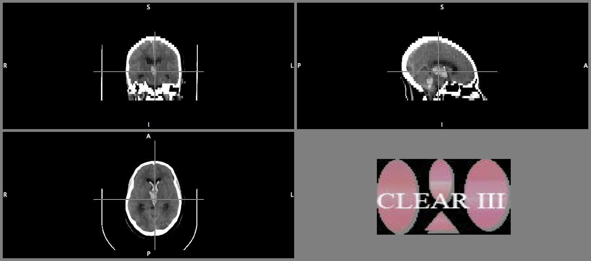

## Strokes are bad

From AHA Stroke statistics 2013 report$^1$:

* Of all strokes, 87% are ischemic and **10%** are intracerebral hemorrhagic strokes, whereas 3% are subarachnoid hemorrhage strokes (GCNKSS, NINDS, 1999).

* Each year, $\approx$ **795,000** people experience a new or recurrent stroke, 610,000 new, 185,000 recurrent.

* On average, **every 40 seconds**, someone in the United States has a stroke (90 strokes/hour)

* Intracerebral hemorrhage has a **high mortality rate**; **38%** survive the first year$^2$

<font size="2">$^1$ Go, Alan S., et al. "Heart disease and stroke statistics—2013 update a report from the American Heart Association." Circulation 127.1 (2013): e6-e245.</font><br>
<font size="2">$^2$ Qureshi, Adnan I., et al. "Spontaneous intracerebral hemorrhage." New England Journal of Medicine 344.19 (2001): 1450-1460.</font>

---

## Stokes affect the elderly

From Italian Longitudinal Study of Aging (ILSA) (**N =5,632** individuals aged 65-84)
* Incidence for first-ever stroke was **9.51** (95% CI: 7.75-11.27) per 1,000 person years and **12.99** (95% CI: 10.99-14.98) including recurrent stroke (total incidence). 

* Crude **mortality was 49.2% among first stroke patients** and 15% among persons without stroke$^3$

<font size="2">$^3$ Di Carlo, Antonio, et al. "Stroke in an elderly population: incidence and impact on survival and daily function." Cerebrovascular Diseases 16.2 (2003): 141-150.</font>

---

## Stroke Trials I'm involved with

* Intracerebral (bleeds mainly in tissue, <strong>ICH</strong>) or Intraventricular (bleeds into ventricles, <strong>IVH</strong>) Hemorrhage trials

* Minimally Invasive Surgery plus rt-PA for ICH Evacuation (<strong>MISTIE</strong>) 


* Clot Lysis: Evaluating Accelerated Resolution of Intraventricular Hemorrhage Phase III (<strong>CLEAR III</strong>)


* http://braininjuryoutcomes.com/mistie-about


---


## MISTIE Trial - Intracerebral Hemorrhage

* Number of patients: **N = `r nrow(alldat)`**, number randomized: **N = `r nrow(rando)`**

* Inclusion criteria: age **18-80** years old 


* MIS group received doses of recombinant-tissue Plasminogen Activator (**rtPA**) - clot buster

* **Over 65 years old**: `r otab["TRUE"]` (`r round(ptrue*100, 1)`%), Surgical: `r tab["TRUE", "Surgical"]` (`r round( ptab["TRUE", "Surgical"]*100, 1)`%), Medical: `r tab["TRUE", "Medical"]` (`r round( ptab["TRUE", "Medical"]*100, 1)`%)

---


## Age Distribution
```{r ggage, fig.align='center'}
# g <- ggplot(data=rando, aes(x=Age, colour=group))
# g <- g + xlab("Age") + ylab("Density") + 
#   ggtitle("Distributon of Age by Randomized Group") 
# # g <- g + geom_vline(xintercept = 0)
                      
# g2 <- g + theme(legend.justification=c(0,0), 
#                 legend.position=c(0,0.82), 
#                 legend.direction= "horizontal",
#                 legend.background = 
#                   element_rect(fill="transparent"),
#                 legend.key = element_rect(
#                   fill="transparent", 
#                   color="gray90")) 
# 
#   
#   
# gage <- g2 +  geom_line(stat="density", lwd=2)  + 
#   scale_color_manual(values=c("blue", "red"), name="Randomized\nGroup")   
# 
# g <- ggplot(data=rando, aes(x=Age, colour=group))
# 
cols <- alpha(c("blue", "red"), 0.6)

gage <- ggplot(rando, aes(x=Age, fill=group)) + geom_histogram(aes(y=..density..), alpha=.6, bin=3) + 
  scale_fill_manual(values=cols, name="Randomized\nGroup") + xlab("Age") + ylab("Density") + 
  ggtitle("Distributon of Age by Randomized Group") 
gage2 <- gage + geom_line(aes(color=group), stat="density", lwd=2)
  scale_color_manual(values=cols, name="Randomized\nGroup")
gage <- gage + geom_segment(aes(x = 65, y = 0, xend = 65, yend = 0.0875), 
                       colour="black")  
                       
gage <- gage + theme(legend.justification=c(0,0), 
                 legend.position=c(0,0.82), 
                 legend.direction= "horizontal",
                 legend.background = 
                   element_rect(fill="transparent"),
                 legend.key = element_rect(
                   fill="transparent", 
                   color="gray90")) 

print(gage)
```

---


```{r tabage}
otab <- table(rando$Age > 65)
ptrue <- prop.table(otab)["TRUE"]
tab <- table(rando$Age > 65, rando$Group_Assigned)
ptab <- prop.table(tab, 2)
nsurg <- sum(rando$Group_Assigned == "Surgical")
nmed <- sum(rando$Group_Assigned == "Medical")
stopifnot((nsurg+nmed) == nrow(rando))
```

## An "Ideal" MISTIE Patient: Blood Clot Formed


---

## An "Ideal"" MISTIE Patient: Catheter Placed


---

## An "Ideal" MISTIE Patient: Clearance!


---


## Clot trajectories: Volume


---

## Clot trajectories: Volume Difference
<font size="2">Method based on: Crainiceanu, Ciprian M., et al. "Bootstrap‐based inference on the difference in the means of two correlated functional processes." Statistics in Medicine 31.26 (2012): 3223-3240.</font>


---

## Clot Trajectories: % of Baseline


---

## Clot trajectories: % Difference


---

## Outcome - modified Rankin Scale

* Outcome - modified Rankin Score (**mRS**) - a functional measure of mobility and $\text{independence}^{4,5,6}$.  Good outcome: $\leq 3$ at 180 Day followup

<font size="2">$^4$ Rankin J. “Cerebral vascular accidents in patients over the age of 60.” Scott Med J 1957;2:200-15</font><br>
<font size="2">$^5$ Bonita R, Beaglehole R. “Modification of Rankin Scale: Recovery of motor function after stroke.” Stroke 1988 Dec;19(12):1497-1500</font><br>
<font size="2">$^6$ Scale from [http://www.strokecenter.org/wp-content/uploads/2011/08/modified_rankin.pdf](http://www.strokecenter.org/wp-content/uploads/2011/08/modified_rankin.pdf)</font>

---

```{r ich_loess}
d <- alldat[order(alldat$Pre_Rand_ICHvol), ]
d2 <- cbind
glo <- ggplot(alldat, aes(x=Pre_Rand_ICHvol, y=Good_Outcome_Day_180)) + geom_smooth(method="loess") + geom_jitter(position = position_jitter(height = .1))
glo <- glo + xlab("Pre-Randomization ICH Volume (cc)") + ylab(expression(paste(mRS <= 3))) + ggtitle("Functional outcome vs. ICH Volume")
```

## Does Blood matter?

```{r plot_loess, fig.align='center'}
print(glo)
```
---

## Does Blood matter?


* Adjusted model seems to indicate that lower end of treatment volume is has higher likelihood of mRS $\leq 3$.
* Not the primary hypothesis for this trial (was a phase II).
* Investigating on a Phase III trial.

<font size="2">CI presentation based on: Louis, Thomas A., and Scott L. Zeger. "Effective communication of standard errors and confidence intervals." (2007).</font>

---


## Neuroimaging Data - voxels = 3D pixels


---

## CT is NOT MRI (specifically not T1/T2)

```{r procon, results='asis'}
ct <- c("Diagnostic", "Houndsfield Units", "One exists", "Measures humans/rooms/beds", "?")
mri <- c("Diagnostic/Research", "Arbitrary", "MNI Standard", "Measures Humans", "Many")
names <- c("Domain", "Units", "Template", "Measures", "Methods")

df <- data.frame(CT=ct, MRI=mri)
rownames(df) <- names
print(xtable(df), type="html")
```

---

## Skull Stripping

* Many applications we want to work with brain only 
* Skull, and other objects are picked up by CT
  * Biological - nasal cavity, eyes 
  * Not biological - cushions, the table
* Try standard MRI software (with some modifications)

---

## Human + Room + FOV


---

## I just want your brain!

* 19 Scans manually segmented and automatically using BET


---

## I just want your brain!

* 19 Scans manually segmented and automatically using BET


---

## Results from 19 Scans


---


## Results from 19 Scans


---


## Clot Prediction - data

* 6 scans (pilot run) from 6 different subjects
* Blood clots are manually segmented
  * Think of tracing a lot of pictures with a mouse
* Skull Stripped images are used to limit only to brain tissue

---


## Predicting Clot

* Run a model (logistic regression) with 10% of the brain with covariates:
  * Raw intensity
  * Z-scores in all 3 planes with whole image
  * Z-scores in all 3 planes with only brain image
* Predict on the 90% not fit using the model
* One hold out subject completely

---

## Results


---

## Individual Results


---


## Conclusions

* Strokes are bad - treatment seems to help
* Volume of blood matters
    * It takes time to estimate
    * Has potential to be done automatically
    * Is related to outcome
* Methods development for CT imaging is open
    * Not as clean as MRI - but not uncommon for diagnostic tools

---


## Thanks

* Dan Hanley and BIOS
* Ciprian Crainiceanu
* Elizabeth Sweeney
* Brian Caffo
* 

---


## Extra Slides

---


---


## Ventricular System


<font size="2">Figure from [http://en.wikipedia.org/wiki/Ventricular_system](http://en.wikipedia.org/wiki/Ventricular_system)</font><br>

---

## An Example CLEAR Patient



---
