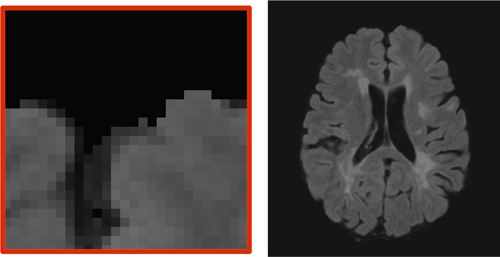

<style type="text/css">
.rightalign {
    float: right;
}
.leftalign {
    float: right;
}
body {
    background-image: url('figure/rplot_loess.png');
    background-color: #cccccc;
}
</style>

Clot Volume Prediction in Stroke
========================================================
author: John Muschelli
date: 2013-Oct-28

Neuroimaging data
========================================================

## Neuroimaging Data 




---

Neuroimaging data
========================================================


For more details on authoring R presentations click the
**Help** button on the toolbar.

- Bullet 1
- Bullet 2
- Bullet 3

Slide With Code
========================================================


```r
summary(cars)
```

```
     speed           dist    
 Min.   : 4.0   Min.   :  2  
 1st Qu.:12.0   1st Qu.: 26  
 Median :15.0   Median : 36  
 Mean   :15.4   Mean   : 43  
 3rd Qu.:19.0   3rd Qu.: 56  
 Max.   :25.0   Max.   :120  
```

Slide With Plot
========================================================

 
