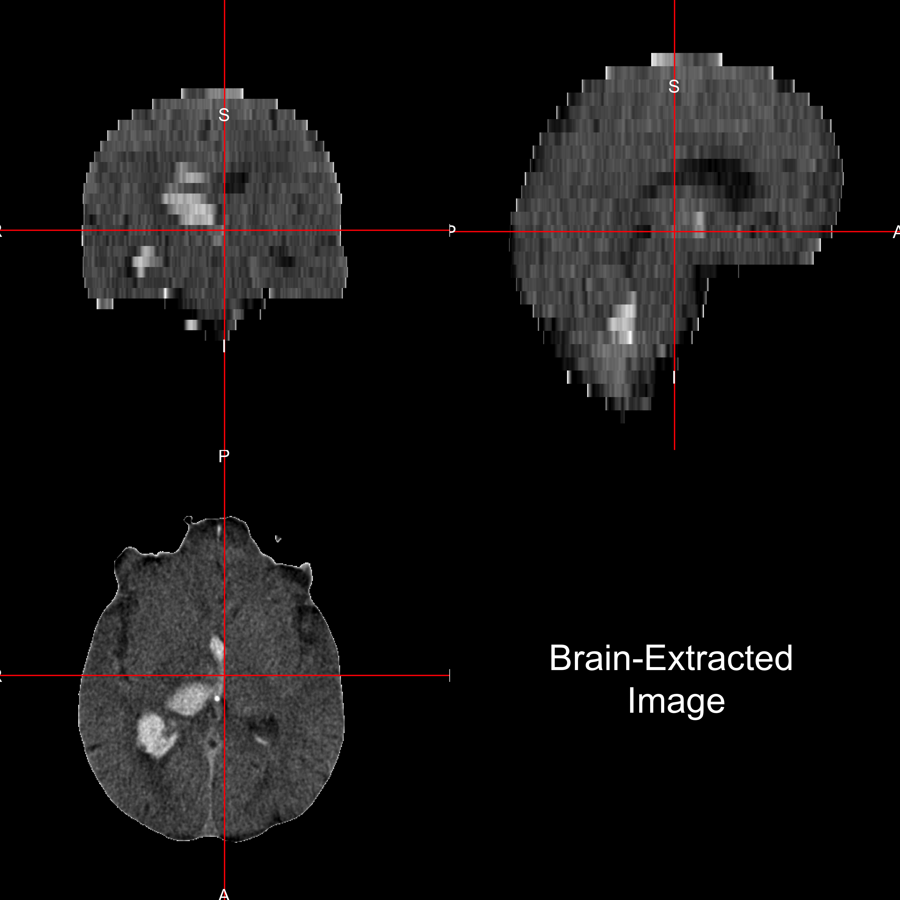
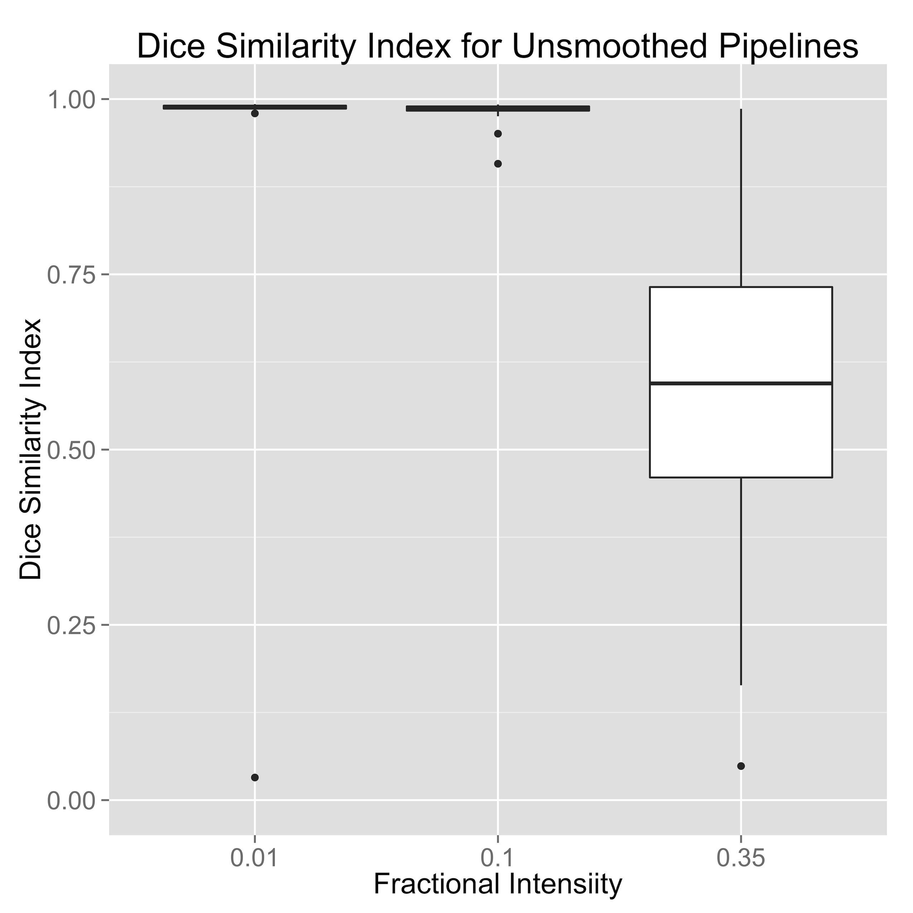
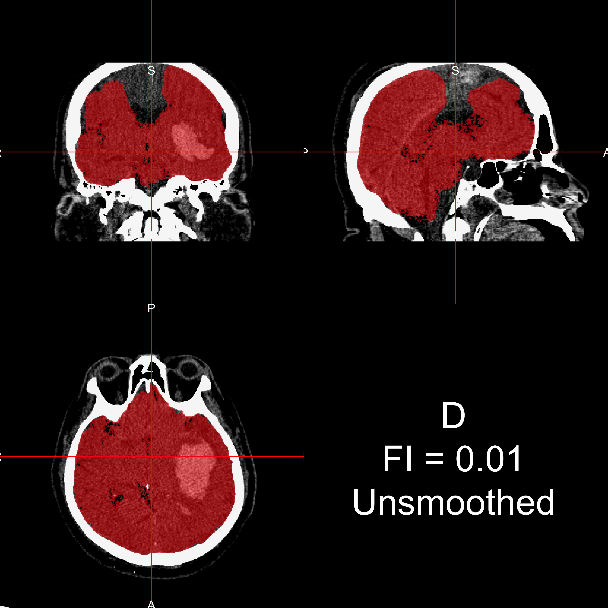
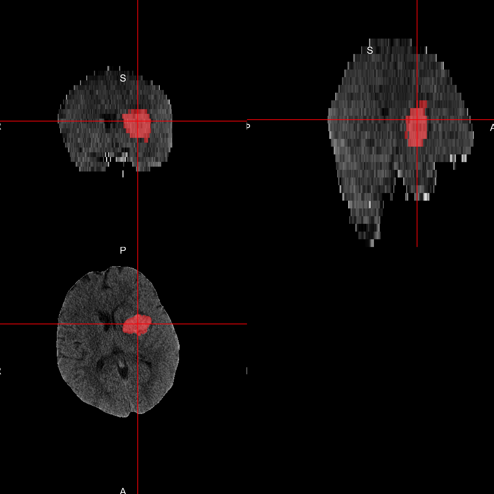

## Stokes affect the elderly

From Italian Longitudinal Study of Aging (ILSA) (**N =5,632** individuals aged 65-84)
* Incidence for first-ever stroke was **9.51** (95% CI: 7.75-11.27) per 1,000 person years and **12.99** (95% CI: 10.99-14.98) including recurrent stroke (total incidence). 

* Crude **mortality was 49.2% among first stroke patients** and 15% among persons without stroke$^3$

<font size="2">$^3$ Di Carlo, Antonio, et al. "Stroke in an elderly population: incidence and impact on survival and daily function." Cerebrovascular Diseases 16.2 (2003): 141-150.</font>

---

## Stroke Trial Data I'm using 

* Intracerebral (bleeds mainly in tissue, <strong>ICH</strong>) or Intraventricular (bleeds into ventricles, <strong>IVH</strong>) Hemorrhage trials

* Minimally Invasive Surgery plus rt-PA for ICH Evacuation (<strong>MISTIE</strong>) 


* http://braininjuryoutcomes.com/mistie-about

---

```{r tabage, echo = FALSE, , warning=FALSE, message = FALSE}
otab <- table(rando$Age > 65)
ptrue <- prop.table(otab)["TRUE"]
tab <- table(rando$Age > 65, rando$Group_Assigned)
ptab <- prop.table(tab, 2)
nsurg <- sum(rando$Group_Assigned == "Surgical")
nmed <- sum(rando$Group_Assigned == "Medical")
stopifnot((nsurg+nmed) == nrow(rando))
```

## CT is NOT MRI (specifically not T1/T2)
<br>
<br>

```{r procon, results='asis', echo=FALSE, warning=FALSE, message = FALSE}
ct <- c("Diagnostic", "Houndsfield Units", "One exists", "Measures humans/rooms/beds", "?")
mri <- c("Diagnostic/Research", "Arbitrary", "MNI Standard", "Measures Humans", "Many")
names <- c("Domain", "Units", "Template", "Measures", "Methods")

df <- data.frame(CT=ct, MRI=mri)
rownames(df) <- names
print(xtable(df), type="html")
```

--- &twocol w1:50% w2:50%

## CT Scan Characteristics

*** {name: left}


*** {name: right}

* Data are in Hounsfield Units (HU), which are "standardized"
* Bone – high intensity (1000 HU)
* Air – low intensity (-1000 HU)
* Water - 0 HU
* Tissue ≈ 0 - 100 HU

---

## Neuroimaging Data - voxels = 3D pixels


---


## Problem: Human + Room + FOV

All "objects" captured


--- &twocol w1:50% w2:50%

## CT Skull Stripping: Goal 

*** {name: left}

Want to go from this


*** {name: right}
To This:


--- &twocol w1:50% w2:50%

## CT Skull Stripping: Step 1 - Threshold

*** {name: left}

Threshold 0- 100 HU:


*** {name: right}
Result:


--- &twocol w1:50% w2:50%

## CT Skull Stripping: Step 2 - Smooth

*** {name: left}

Smooth Image with 1mm Gaussian


*** {name: right}
Result:


--- &twocol w1:50% w2:50%

## CT Skull Stripping: Step 3 - Run BET

*** {name: left}

Run BET (Brain Extraction Tool) from FSL:


*** {name: right}
Result (Skull Stripped Image):


--- &twocol w1:50% w2:50% bg:#d3d3d3


## 22 Scans: manual vs automatic skull stripping
 
*** {name: left}



*** {name: right}


--- &twocol w1:50% w2:50% bg:#d3d3d3

## Validation: Choosing one pipeline to rule them all
 
*** {name: left}

Note change of y-axis


*** {name: right}
Sensitivity/Specificity


--- &twocol w1:50% w2:50%

## Validation: Smoothing Matters
 
*** {name: left}



*** {name: right}


--- 

## "But that was only 20 scans"

1062 images from 133 patients, excluding 115 scans for craniotomy or skull stripping failure (9.8%).  Intraclass correlation estimate: 0.93, (95%CI : 0.91, 0.95). 


--- &twocol w1:50% w2:50%


## What about those "failures"


--- 

## Code to do this

* R code: http://bit.ly/CTBET_RCODE
  * Based on fslr - R package to interface with FSL
  * Paper submitted
* bash code: http://bit.ly/CTBET_BASH

---

## ICH Prediction - data

* ICH are manually traced (**gold standard**)



---

## ICH Prediction - data

* ICH are manually traced (**gold standard**)
  * Time-consuming
  * Within and across-rater variability
* Can't do for large databases
  * Important for some processes, such as image registration

---


## **Primary Intracerebral Hemorrhage Prediction Employing Regression and Features Extracted from CT (PItcHPERFECT)** 

* Creating predictor variables:
  * Raw intensity
  * Z-scores in all 3 planes with only brain image (skull stripped)
  * Indicator if intensity **$\geq 40$** (established threshold) & $\leq 80$ HU
  * Local moments (mean, sd, skew, kurtosis)
  * Large smoothers
* Run a **logistic regression** with these
* Model built on 10 subjects

---


## Example Output: Skull Stripped Image
 


---

## Example Output: Manual Segmentation
 


---

## Example Output: Automatic Segmentation
 


---

## Prediction Comparison
 


---

## Prediction Result: Population
 


---

## Conclusions and Extensions
 
* Skull stripping can be done
  * Important in many analyses (e.g. image registration)
  * May use intracranial volume to standardize ICH volume


---

## Conclusions and Extensions
 
* Skull stripping can be done
  * Important in many analyses (e.g. image registration)
  * May use intracranial volume to standardize ICH volume
* ICH Segmentation has high specificity
  * Good for Localization
  * OK for volume estimates
  * Good enough for adaptive randomization

---


## Conclusions and Extensions
 
* Skull stripping can be done
  * Important in many analyses (e.g. image registration)
  * May use intracranial volume to standardize ICH volume
* ICH Segmentation has high specificity
  * Good for Localization
  * OK for volume estimates
  * Good enough for adaptive randomization
* Many new problems open and available
  * Can use these methods for **large datasets**
* Use for other diseases with CT imaging

---


## Conclusions and Extensions

* Virtual International Stroke Trials Archive (VISTA)

> "The purpose is to create an international consortium of investigators and a repository of source MRI and CT images toward the objectives of standardization and validation of acquisition, analytic, and clinical research methods of image-based stroke research."

---

## Conclusions and Extensions
 
* Skull stripping can be done
  * Important in many analyses (e.g. image registration)
  * May use intracranial volume to standardize ICH volume
* ICH Segmentation has high specificity
  * Good for Localization
  * OK for volume estimates
  * Good enough for adaptive randomization
* Many new problems open and available
  * Can use these methods for large datasets
* Use for other diseases with CT imaging

---
## Thanks

* Questions

---


## MISTIE Trial - Intracerebral Hemorrhage

* Number of patients: **N = `r nrow(alldat)`**, number randomized: **N = `r nrow(rando)`**

* Inclusion criteria: age **18-80** years old 


* **Over 65 years old**: `r otab["TRUE"]` (`r round(ptrue*100, 1)`%), Surgical: `r tab["TRUE", "Surgical"]` (`r round( ptab["TRUE", "Surgical"]*100, 1)`%), Medical: `r tab["TRUE", "Medical"]` (`r round( ptab["TRUE", "Medical"]*100, 1)`%)

--- &twocol w1:50% w2:50%


## An "Ideal" MISTIE Patient: ICH Formed


---

## An "Ideal"" MISTIE Patient: Catheter Placed


---

## An "Ideal" MISTIE Patient: Clearance!


---


